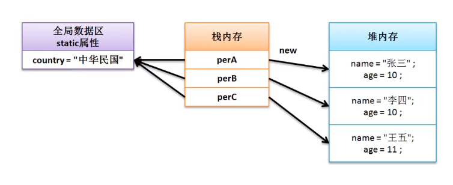
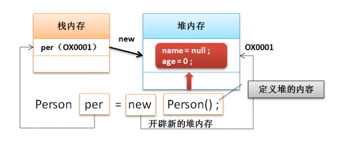
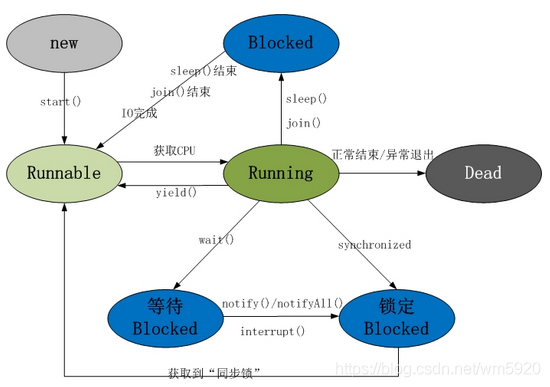
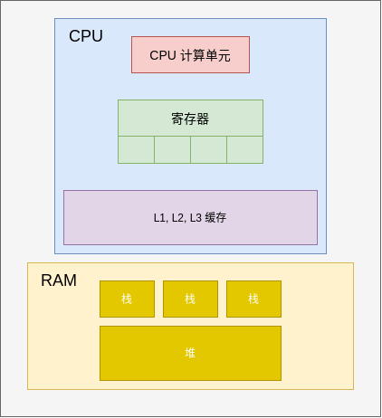

# Java

## 1. Java SE(Java Platform , Standard Edition)

### 1.1 static 修饰符

+ **综述**

  > 1. `static` 修饰的东西, 只会在`类加载`的时候初始化一次
  > 2. 常被用于 `不需要创建对象`即可使用类方法和访问类变量
  > 3. `static` 修饰的变量是可以修改的, 通常需要加 `final` 一起用

+ **修饰方法**

  > 1. 静态方法没有 `this` 指针
  > 2. 静态方法内无法调用`非静态的变量和方法`, 反过来可以. 因为非静态的变量和方法在`创建对象`的时候才会`初始化`

+ **修饰变量**

  > 1. 静态变量在内存中`只有一份`, 在`类加载` 的时候创建并初始化
  >
  > 2. 多个`对象` 共享一个`静态变量`
  >
  >    > 

+ **修饰代码块**

  > 1. `static` 也可以一次修饰多个语句, 常用于`批量初始化`变量
  >
  >    > ```java
  >    > class Test{
  >    >     private static final Integer a, b;
  >    >     static {
  >    >         a = 1;
  >    >         b = 2;
  >    >     }
  >    >     // 其他代码
  >    > }
  >    > ```

---

### 1.2 堆内存和栈内存

+ **综述**

  > 1. `堆内存`保存的是`对象的具体信息`, 通过关键字 `new` 开辟空间
  >
  > 2. `栈内存`保存的是一块`堆内存`的`地址`, 即保存 `引用`
  >
  > 3. `对象创建`和`引用传递`
  >
  >    
  >
  >    

---

### 1.3 垃圾空间

+ **综述**

  > 1. `垃圾空间` 是指没有任何`栈内存指向`的`堆内存空间`
  > 2. `垃圾空间` 会被 `GC(Garbage Collector)` 定期回收

### 1.4 对象向上和向下转型

+ **向上转型**

  + **例子**

    > ```java
    > // class Apple extend Fruit
    > Fruit fruit = new Apple();
    > ```
    >
    > 1. 此时 `fruit` 引用了 `Fruit` 的子类, 称为向上转型
    > 2. `fruit` 可以调用 `Apple 类` 中属于 `Fruit 类` 的属性和方法`( 如果方法被重写, 那么调用的是重写后的方法 )`.
    > 3. `fruit` 无法调用 `Apple 类` 中不属于 `Fruit 类` 的属性和方法

  + **应用**

    > ```java
    > //class Apple extend Fruit
    > class Test{
    >     public void main(){
    >         run(new Fruit());
    >         run(new Apple());
    >     }
    >     
    >     private void run(Fruit fruit){
    >         fruit.anymethod();
    >     }
    >     
    > }
    > ```
    >
    > 1. 上述例子通过 `向上转型` , 省去了 `run` 方法的重载.

+ **向下转型**

  + **例子**

    > ```java
    > // class Apple,Orange extend Fruit
    > Fruit fruit = new Apple(); //向上转型
    > Apple apple = (Apple) fruit; // (Apple) fruit 称为向下转型, 不会报错
    > 
    > Fruit fruit = new Apple();// 向上转型
    > Orange orange = (Apple) fruit; // 向下转型失败, 编译成功, 运行失败
    > ```

### 1.5 泛型( Generics )

+ **综述**

  > 1. `泛型` 是指 类, 接口或者方法使用 `类型(Types)` 进行初始化, 通常用于编写 `集合/容器` 类.

  > 1. `Java` 着重于`类型安全(Type Safe)`, 大部分 `类型错误` 会在`编译期`被发现, 但是如果使用`强制类型转换`, 这种错误很难在编译期发现.  
  > 2. `Java 5` 之前, 一般使用 `Object` 实现 `泛型` 功能, 但是需要使用 `强制类型转换`, 带来很大的 `安全隐患`.
  > 3. `Java 5` 之后, 引入 `<>` 的方法, 在编译期就可以发现`类型错误`.

+ **例子**

  > 1. **泛型类**
  >
  >    > ```java
  >    > public class Test<T> {
  >    >     private T val;
  >    >     
  >    >     public T getVal() {
  >    >         return val;
  >    >     }
  >    >     public T setVal(T val) {
  >    >         this.val = val;
  >    >     }
  >    > }
  >    > ```
  >    >
  >    > 
  >
  > 2. **泛型方法**
  >
  >    > ```java
  >    > // <Class> 是使用泛型的类(多是集合)
  >    > public <T> <Class><T> print(Test<T> a, Test<T> b){}
  >    > ```
  >    >
  >    > 

+ **通配符**

  + **综述**

    > 1. 通常用于 `泛型方法` 中传入参数

  + **用法**

    > 1. 上界通配符
    >
    >    
    >
    > 2. 下界通配符
    >
    >    

  + **例子**

    > ```java
    > // <Class> 是使用泛型的类(多是集合)
    > public <Class><? extends Number> print
    >     (<Class><? extends Number> a, 
    >      <Class><? extends Number> b)
    > ```

### 1.6 进程和线程

+ **线程**

  1. **综述**

     > 1. 线程之间共享的数据 : 在`主线程声明`的变量
     >
     > 2. 线程独有的数据 : 在`线程内声明`的变量
     >
     > 3. 线程有五种状态
     >
     >    
     >
     >    > 1. 调用 `new Thread()` 之后进入 `New`
     >    >
     >    > 2. 调用 `Thread.start()` 之后进入 `Runnable` , 随时接受 `CPU 调度`.
     >    >
     >    > 3. 接受 `CPU 调度` 后, 进入 `Running`
     >    >
     >    > 4. 线程暂时放弃 `CPU 的使用权` , 进入 `Blocked` , 其中 `Block` 分为三种
     >    >
     >    >    > 1. 调用 `Thread.wait()` 方法, 线程进入 `Wait Blocked`
     >    >    > 2. 调用 `sleep() / join()` 方法, 或者发出 `I/O 请求` , 线程进入 `Other Blocked` . 当 `sleep()超时`、`join()等待的线程终止或者超时`,  `I/O处理完毕时`，线程进入 `Runnable` 
     >    >    > 3. 线程获取 `Synchronized 锁` 失败, 进入 `Synchronized Blocked`
     >    >
     >    > 5. 执行完或者因为异常退出了 `Thread.run()` 方法, 则进入 `Dead`

  2. **可能存在的问题**

     > 1. 数据更新的`可见性 ( Visibilty )`
     >
     >    > 1.  `CPU 更新数据`的时机是`不确定的( 处理完之后不一定立即写入 RAM )`
     >    > 2. 如果线程A `更新共享数据`到 **RAM** 之前, 线程B 从 **RAM** 中`读取了这个数据`, 则这个数据的`更新`对于 线程B 来说是 `不可见的`
     >
     > 2. 程序的 `执行顺序( Order )`
     >
     >    > 1. JVM( JIT ) 会进行 `指令优化`
     >    > 2. 这可能会导致 `程序执行的顺序` 和 `CPU 最终执行指令的顺序`并`不一致`, 导致 `可见性` 被破坏

  3. **解决的方法**

     > 1. **Volatile** 和 **Synchronized** 和 **Lock**
     >
     >    > 1. 被 **Volatile** 修饰的**变量**的 `写操作` 会立即写入 `RAM` 中, 而 `读操作` 会从 `RAM` 中读取
     >    > 2. 被 **Synchronized** 修饰的**代码块**, 同一时间 `只有一个线程` 可以执行.
     >    > 3. 
     >
     > 2. `Happen-Before` 原则 :  在 `线程 A` 执行 `Volatile Write/Synchronized Block` 之前的**变量更新**, 在 `线程 B` 执行 `Volatile Read/Synchronized Block` 之后都是`可见的`. 
     >
     > 3. 总结的来说, **Happen-Before 原则** 是对 `JVM( JIT ) 指令优化` 的`限制`.

### 1.7 集合

+ **Collection**

  + **Collection 综述**

    > 1. 全部`单值`存储容器都要 `实现的接口`
    >
    > 2. Colection 的 `CRUD` 示例 
    >
    >    > ```java
    >    > <List/Set><String> list/set = New <Collection 实现类><>();
    >    > 
    >    > list.add("a");//增
    >    > 
    >    > list.remove(0);//删
    >    > 
    >    > list.set(0,"A");//改
    >    > 
    >    > list.get(0);//查
    >    > 
    >    > Collections.sort(list);//排序, 字符串根据 ASCII
    >    > Collections.max(list);// 找到最大值
    >    > Collections.min(list);// 找到最小值
    >    > 
    >    > //for-each遍历, 遍历中无法删除元素
    >    > for (String s: list/set){
    >    > System.out.println(s);
    >    > }
    >    > 
    >    > //迭代器遍历, 遍历中可以删除元素
    >    > Iterator<String> iterator = list/set.iteator();
    >    > while (iterator.hasNext()){
    >    >  iterator.next();
    >    >  iterator.remove(); //使用迭代器删除元素
    >    > }
    >    > 
    >    > //输出全部值
    >    > System.out.println(list/set);
    >    > ```
    > 3. 单线程 `迭代` 的过程使用 `<Collection 实现类>.remove()` 会出现并发更新异常. 需要使用 `Iterator.remove()` 

  + **List**

    0. **综述**

       > 1. 元素`有序存储`
       >
       >    > 1. 元素`存储顺序`和 `插入顺序` 一致
       >
       > 2. 支持 `任意访问`
       >
       > 3. 存储的元素 `可以重复`
       >
       
    1. **LinkedList**
    
       + **综述**
    
       > 1. 底层数据结构是`链表`, 线程不安全
         > 2. 没有 `动态扩容`

    2. **ArrayList**

       + **综述**
    
       > 1. 底层数据结构是`数组` , 线程不安全
         > 2. 默认构造`空数组`, 使用的时候开辟大小为 `10` 的空间
       > 3. 空间不足的时候, 扩容 `现有空间 / 2`的大小, 然后进行数据搬移.
    
  3. **Vector**
     
       + **综述**
       
       > 1. 底层数据结构是`数组`, 线程安全

+ **Set**
  
  0. **Set 综述**
  
     > 1. 无法保存 `重复的元素`
       > 2. 不支持`任意访问`

    1. **HashSet**

       + **综述**
  
       > 1. 底层数据结构是 `数组+链表 = 哈希表`
         > 2. 线程不安全
       > 3. 元素 `无序存储`
         > 4. 存储过程
       >    1. 计算存储对象的 `HashCode(int 型)`
         >    2. 检查 `HashCode`的位置是否有`已储存的对象` , 没有则将新对象存储在 `HashCode` 的位置
         >    3. 如果存在已储存的对象, 则调用 `equals()` 方法比较内容, 不相等则在 `HashCode` 的位置 `追加储存(解决地址冲突)`
         >    4. 如果两个对象的`内容也相等`, 则放弃存储
  
       + **LinkedHashSet**
  
         > 1. 使用 `链表` 维护元素的`插入次序`
         >
       > 2. 元素可以 `"有序"存储`
         >
       >    > 1. `迭代顺序`与`插入顺序`一致
         >
         > 3. 线程不安全
  
    2. **TreeSet**
  
       + **综述**
  
       > 1. 底层数据结构是 `红黑树`
         > 2. 元素 `"有序"` 存储
       >    1. 根据元素本身的 `compareTo(实现 Comparable 接口)` 方法 `有序存储`
         >    2. 或者自己实现 `compare(实现 Comparator 接口)` 方法 `有序存储`
       >    3. 上述两者均存在时 , 优先使用 `compare` 方法.
  
+ **Map**

  + **Map的综述**
  
    > 1. 用来存储 `<Key:Value>` 数据
    >
    > 2. Map 的**CRUD**
    >
    >    > ```java
    >    > Map<Integer,String> map = new <Map 实现类>();
    >    > 
    >    > map.put(1,"a");//添加
    >    > 
    >    > map.remove(1);//删除
    >    > 
    >    > String s = map.get(1);//查询
    >    > 
    >    > map.replace(1,"A");//修改
    >    > 
    >    > //for-each 遍历
    >    > for (Map.Entry<String, String> entry : 
    >    >      map.entrySet()){
    >    >     System.out.println(entry)
    >    > }
    >    > 
    >    > //迭代器遍历
    >    > Iterator<Map.Entry<String, String>> iterator = map.entrySet().iterator();
    >    > while (iterator.hasNext()){
    >    >     Map.Entry<String, String> entry = iterator.next();
    >    >     iterator.remove();
    >    > }
    >    > ```
    >    >
    >    > 
    
  + **HashTable**
  
  + **HashMap**
  
  + **TreeMap**
  
  + 

### 1.8 JVM ( Java Virtual Machine )

1. **JVM 的内存模型 ( 线程的角度 )**

   + **结构**

     

   + **综述**

     > 1. `堆` 是**全部线程**和 **CPU核心** `共用`的, 存放的是变量`具体的值`
     >
     > 2. `栈` 是`线程独有`的, 存放的是在`线程内声明` 的变量的`引用`, 存放堆中对应的内存地址
     >
     > 3. 多线程下的内存模型 : 每个线程都有`自己的 CPU`,  RAM 是`全部线程共用`的.
     >
     > 4. `CPU` 处理数据流程
     >
     >    > 1. `CPU 处理单元` 从`缓存`取数据到`寄存器`
     >    > 2. 没有则从 `RAM( 栈-->堆 )` 中`复制`一份数据到`CPU ( 缓存 --> 寄存器)`中
     >    > 3. `CPU 计算单元`处理完之后`更新堆中的数据

2. **JVM 指令优化**

   + **指令并行优化**

     > 1. CPU 指令`并行优化`
     >
     >    > 1. CPU 会从`待执行的指令队列`中找出 `可以并行`的指令 
     >    > 2. 将`可以并行` 的指令放在不同的流水线执行, 加速 **CPU** 运行速度.
     >
     > 2. JVM( JIT ) 指令 `并行优化`
     >
     >    > 1. JVM ( JIT ) 在`编译阶段`找出`可以并行`的指令
     >    > 2. 将指令`重新排序`之后再输入 **CPU**