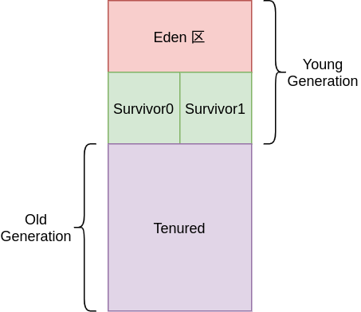
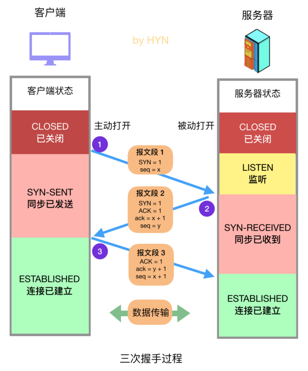
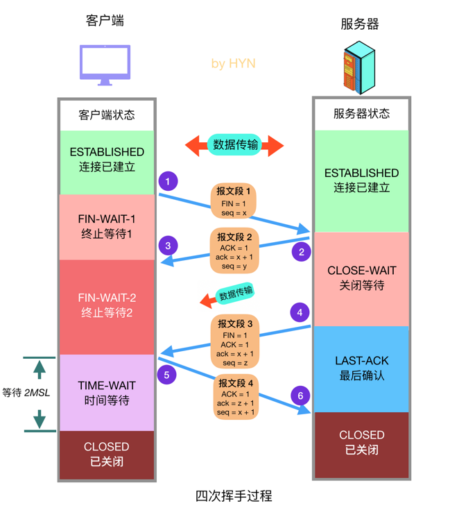

# Java


## 对象向上和向下转型

### 向上转型

#### 例子

> ```java
> // class Apple extend Fruit
> Fruit fruit = new Apple();
> ```
>
> 1. 此时 `fruit` 引用了 `Fruit` 的子类, 称为向上转型
> 2. `fruit` 可以调用 `Apple 类` 中属于 `Fruit 类` 的属性和方法`( 如果方法被重写, 那么调用的是重写后的方法 )`.
> 3. `fruit` 无法调用 `Apple 类` 中不属于 `Fruit 类` 的属性和方法

#### 应用

> ```java
> //class Apple extend Fruit
> class Test{
>  public void main(){
>      run(new Fruit());
>      run(new Apple());
>  }
> 
>  private void run(Fruit fruit){
>      fruit.anymethod();
>  }
> 
> }
> ```
>
> 1. 上述例子通过 `向上转型` , 省去了 `run` 方法的重载.


### 向下转型

#### 例子

> ```java
> // class Apple,Orange extend Fruit
> Fruit fruit = new Apple(); //向上转型
> Apple apple = (Apple) fruit; // (Apple) fruit 称为向下转型, 不会报错
> 
> Fruit fruit = new Apple();// 向上转型
> Orange orange = (Apple) fruit; // 向下转型失败, 编译成功, 运行失败
> ```


## 泛型( Generics )

### 综述

> 1. `泛型` 是指 类, 接口或者方法使用 `类型(Types)` 进行初始化, 通常用于编写 `集合/容器` 类.

> 1. `Java` 着重于`类型安全(Type Safe)`, 大部分 `类型错误` 会在`编译期`被发现, 但是如果使用`强制类型转换`, 这种错误很难在编译期发现.  
> 2. `Java 5` 之前, 一般使用 `Object` 实现 `泛型` 功能, 但是需要使用 `强制类型转换`, 带来很大的 `安全隐患`.
> 3. `Java 5` 之后, 引入 `<>` 的方法, 在编译期就可以发现`类型错误`.


### 例子

> 1. **泛型类**
>
>    > ```java
>    > public class Test<T> {
>    >  private T val;
>    > 
>    >  public T getVal() {
>    >      return val;
>    >  }
>    >  public T setVal(T val) {
>    >      this.val = val;
>    >  }
>    > }
>    > ```
>    >
>    > 
>
> 2. **泛型方法**
>
>    > ```java
>    > // <Class> 是使用泛型的类(多是集合)
>    > public <T> <Class><T> print(Test<T> a, Test<T> b){}
>    > ```
>    >
>    > 


### 通配符

#### 综述

> 1. 通常用于 `泛型方法` 中传入参数


#### 用法

> 1. 上界通配符
>
>    
>
> 2. 下界通配符
>
>    


#### 例子

> ```java
> // <Class> 是使用泛型的类(多是集合)
> public <Class><? extends Number> print
>  (<Class><? extends Number> a, 
>   <Class><? extends Number> b)
> ```


## HashMap 设计与实现

### 前情提要

> 1. **equals 方法**
>
>    > 1. 没有覆写, 则比较两个对象的 `地址` 是否相等
>    >
>    > 2. 覆写后, 用于比较两个对象的 `值` 是否相等
>    >
>    >    ```java
>    >    int a=1;
>    >    int b=1;
>    >    
>    >    // 没有覆写
>    >    a.equals(b); // 结果为 false
>    >    
>    >    // 覆写为比较两个对象的 值
>    >    a.equals(b); // 结果为 true
>    >    ```
>    >
>    > 
>
> 2. **hashCode 方法**
>
>    > 1. 输入对象的 **地址**, 输出 `一个整数`
>    >
>    >    > 1. 一般的来说, 就是把 **任意长度的输入, 变换为固定长度的输出**
>    >
>    > 2. 不同的输入可能会 `导致相同的输出`
>
> 3. 两者在 **HashMap** 中的约束
>
>    > 1. **equals()** 相等, 则 **hashCode()** 也要相等
>    >
>    > 2. 重写 **hashCode()** , 也要重写 **equals()**
>    >
>    >    > 因为 **equals()** 默认情况和 **hashCode()** 一样

### 阈值( threshold )和负载因子( loadFactor ) 和 初始化

#### 源码

```java
// HashMap 中 初始化操作的字段
int threshold;
final float loadFactor;
int modCount;
int size;
```


#### 讲解

> 1. **threshold** 代表 **hashMap** 可以容纳的最大键值对数量( 包括`拉链存储`的键值对 )
>
>    ```java
>    threshold = length * loadFactor;
>    ```
>
> 2. **loadFactor** 是对`空间和时间`的一个取舍
>
>    > 1. **loadFactor** 越小, 说明越早进行扩容, 即 hashMap 越大, 发生 `哈希冲突` 的概率就越小, 即性能越好. 属于空间换时间
>    > 2. **loadFactor** 越大, 则与上述相反
>
> 3. **length** 是 hashMap 实际长度( 不包括`拉链存储` 的键值对 )
>
>    > 1. **length** 初始化为 16
>    >
>    > 2. **length** 一定是 `2 的 n 次方`, 且每次扩容为原来大小的`两倍`
>    >
>    >    > 1. 常规的方法是设置 **length** 为 `素数`, 因为素数比合数发生哈希冲突的`概率要小`
>    >    > 2. 设置 **length** 为 2的n次方, 主要是方便取模和扩容.
>    >    > 3. 同时, 为了减少 哈希冲突 的概率, java 对 `哈希寻址` 做了优化
>
> 4. **size** 是 **hashMap** 中 `实际存储` 的键值对数量, 与 **length** 需要区分
>
> 5. **modCount** 是 **hashMap** 结构发生变化的次数, 比如新增键值对等行为
>
> 6. 当 **指定 HashMap 的容量初始化时( 例如指定 X )**, 会选择一个 `大于等于 X` 的 **2的n次方 **作为初始化的容量


### 寻址

#### 示意图


#### 主要步骤

> 1. 计算 **Key** 的 `hashCode` 
>
> 2. **高位运算 + 异或运算**, 得到新的 `hashCode`
>
> 3. 最后进行 `取模运算`, 得到最终的地址
>
>    > 1. 因为 **length** 总是 **2的n次方**, 所以对 **length-1** 的`按位与` 运算等价于 `取模运算`
>    >
>    >    ```java
>    >    // 当且仅当 b为2的n次方时成立
>    >    a % b == a & (b - 1);
>    >    ```
>    >
>    > 
>    >
>    > 2. 但是 `按位与` 运算比 `取模运算` 更快


#### 源码

```java
static final int hash(Object key) {
    int h;
    
    // 计算一次 hashCode, 然后右移16位( 取高位数值 )
    // 将原来的 hashCode 与右移的 hashCode 做 异或运算
    // 得到最终的 hashCode
    return (key == null) ? 0 : (h = key.hashCode()) ^ (h >>> 16);
}

// 取模运算, 根据 hashCode 得到实际在 hashMap 中的位置
static int indexFor(int h, int length) {
     return h & (length-1); 
}
```


### 插入

#### 示意图


#### 主要步骤

> 1. 如果该位置 `没有元素` , 则直接插入
> 2. 如果有元素, 则逐个元素调用 `equals()` 方法
> 3. 返回 **true** 则 `直接覆盖` ; 返回 **false** 则在 `尾部插入`
> 4. 如果链表长度 大于**8**, 则 `树化为红黑树`, 然后插入
> 5. 如果插入后 **size > threshold** , 则扩容


#### 源码

```java
public V put(K key, V value) {
    
    // 对 key 的 hashCode() 做 hash
    // 然后使用 putVal
    return putVal(hash(key), key, value, false, true);
}

final V putVal(int hash, K key, V value, boolean onlyIfAbsent,
               boolean evict) {
    
    Node<K,V>[] tab; Node<K,V> p; int n, i;
    
    // 1.lazy-Load, 即 真正放入元素时 才初始化 hashMap
    if ((tab = table) == null || (n = tab.length) == 0)
        n = (tab = resize()).length;
    
    // 2.计算地址, 如果该位置为空
    //   即没有相同的 Key, 则直接插入
    if ((p = tab[i = (n - 1) & hash]) == null)
        tab[i] = newNode(hash, key, value, null);
    
    else {
        Node<K,V> e; K k;
        
        // 3.如果存在相同的 Key 和 Value ,则直接覆盖
        if (p.hash == hash &&
            ((k = p.key) == key || (key != null && key.equals(k))))
            e = p;
        
        // 4. 否则判断是否为 红黑树
        // 	  是则插入到树中
        else if (p instanceof TreeNode)
            e = ((TreeNode<K,V>)p).putTreeVal(this, tab, hash, key, value);
        
        else {
            
            // 5. 否则遍历链表, 查看是否存在相同的 Value
            for (int binCount = 0; ; ++binCount) {
                if ((e = p.next) == null) {
                    p.next = newNode(hash, key, value, null);
                    
                    // 链表长度大于8, 转换为红黑树
                    if (binCount >= TREEIFY_THRESHOLD - 1)
                        treeifyBin(tab, hash);
                    break;
                }
                
                // 存在相同的 Key 和 Value
                // 则直接覆盖
                if (e.hash == hash &&
                    ((k = e.key) == key || 
                     (key != null && key.equals(k))))
                    break;
                
                // 不存在则在尾部插入
                p = e;
            }
        }
        if (e != null) { // existing mapping for key
            V oldValue = e.value;
            if (!onlyIfAbsent || oldValue == null)
                e.value = value;
            afterNodeAccess(e);
            return oldValue;
        }
    }
    ++modCount;
    
    // 超过最大容量 就扩容
    if (++size > threshold)
        resize();
    afterNodeInsertion(evict);
    return null;
}

```


### 扩容

#### 示意图( JDK1.7 )


> 1. 链表在扩容之后发生 `倒置` , 因为 **Java7** 采用的是 `头插法`, **Java8** 不会
> 2. 每一个元素都要进行 `重新哈希` , 比较耗时. **Java8** 采用比较巧妙的方法解决此问题


#### 不需要重新哈希的方法


> 1. **length** 总是 2的n次方, 即当发生扩容时, length 只会增加一位 1
>
>    ```java
>    1111(16) --> 0001 1111(32)
>    ```
>
> 2. 那么, 只需要根据元素 **原来的哈希值** 在 **length** 新增加的那一位 `是否为 1`, 即可判断该元素 `是否需要移动位置( 1则需要移动, 0 则不需要)`
>
> 3. 如果需要移动, 那么
>
>    ```java
>    // 因为 newIndex = hash & (length - 1)
>    // hash 是不会变的, 
>    // 那么 newIndex 只跟 length - 1有关
>    newIndex = oldIndex + oldCap;
>    ```
>
> 


### 红黑树

#### 二叉查找树


> 1. 左结点 `一定小于` 右结点
>
> 2. 当存在 **1,2,3,4,5,6,7,8** 这样的数据, 二叉查找树 `退化为 链表` 
>
>    > 查找性能由 `O(log n)` 退化为 `O(n)`
>
> 3. 为了解决这个问题 , 提出了 `平衡二叉树`, `红黑树` 就是一种平衡二叉树
>
>    > **平衡二叉树** 保证了 `树的高度(查找速度) 为 O(log n)`


#### 基本属性

> 1. 结点只有 `红色或黑色`
>
> 2. **根结点** 和 **叶子结点(nil)** 均为 `黑色结点`
>
>    > 1. **nil** 的意思是指, 每个结点都有两个 `值为 null` 的空结点, 直到有`真正的结点`插入
>    >
>    >    
>
> 3. `红色结点`的叶子结点`一定是`黑色结点
>
> 4. 从**一个结点**出发, 到该结点的 `任何一个叶子结点`, 路径上包含的 `黑结点` 数量相同
>
>    > 1. 计数的时候不包含本身
>    > 2. 最短路径 : 路径上 `只有` 黑色结点
>    > 3. 最长路径 : **红色** 和 **黑色** 结点交替出现
>    > 4. 最长路径`不会长于两倍` 的最短路径
>
> 5. 红黑树的操作 --> O(log n)
>
>    > 1. **查找**
>    >
>    >    > 与二叉查找树一致
>    >
>    > 2. **插入**
>    >
>    >    > 1. 因为插入的结点总是设为 `红色` , 故意破坏 **红黑树** 的约束, 从而通过 `旋转和变色` 来重新达到平衡
>    >    > 2. 插入包含 **寻找插入位置** 和 **自平衡过程**, 前者是查找操作, 后者最坏的情况是对 `整棵树` 进行 **自平衡** , 所以总的复杂度是 `O( log n)`


#### 旋转

> 1. 全部旋转的**时间复杂度**都是 `O(1)`
>
>    > 1. 因为红黑树的存储一般使用 `链表` 

##### **左旋**

+ **示意图**

  

+ **步骤**

  > 1. 将 **被旋转的结点** 的 **右结点** 的`左子树`作为 本结点的 `右结点` (左旋转 --> 右左子树 )
  >
  >    
  >
  > 2. 将 **被旋转的结点** 接到 **其右结点** 的 `左结点`
  >
  >    .png)
  >
  > 3. 即 **被左旋的结点** 作为 **其右结点 **的`左子树`


##### **右旋**

+ **示意图**

  

+ **步骤**

  > 1. 将 **被旋转的结点** 的 **左结点** 的`右子树`作为 本结点的 `左结点` (右旋转 --> 左右子树 )
  >
  >    .png)
  >
  > 2. 将 **被旋转的结点** 接到 **其左结点** 的 `右结点`
  >
  >    -1621773074103.png)
  >
  > 3. 即 **被右旋的结点** 作 为 **其左结点 **的`右子树`

#### 插入策略

##### Z 关系


> 1. Z 是要插入的结点
> 2. 插入的结点总是 `红色` 的


##### Z 是根结点

> 1. 将 Z 涂成 `黑色`
>
>    .png)


##### Z 的 uncle 是红色结点

> 1. 将 Z 的 **Uncle 和 Parent** 涂成`黑色`, 而 **Grandparent** 涂成`红色`
>
>    .png)


##### Z 的 uncle 是黑色并且呈现 三角关系

> 1. 其中 **Z, Z.Parent** 都是 `红色`
>
>    
>
>    > 1. 即 **Z** 是 **Z.Parent** 的 `左/右` 结点, 而 **Z.Parent** 是 **Z.GrandParent** 的`右/左` 结点
>
> 2. 此时需要对 **Z.Parent** 进行与 `Z 的方向相反`的旋转
>
>    > 左图进行右旋, 右图进行左旋


#### Z 的 uncle 是黑色并且呈现 直线关系

> 1. 其中 **Z, Z.Parent** 都是 `红色`
>
>    
>
>    > 即 **Z** 是 **Z.Parent** 的 `左/右` 结点, 而 **Z.Parent** 是 **Z.GrandParent** 的`左/右` 结点
>
> 2. 此时需要对 **Z.GrandParent** 进行与 `Z 的方向相反`的旋转
>
>    > 左图进行 左旋, 右图进行 右旋
>
> 3. 并且需要对 **Z.GrandParent** 和 **Z.Parent** 进行涂色


#### 删除策略


### 线程安全问题

#### **JDK 1.7**

##### 源码

```java
void transfer(Entry[] newTable, boolean rehash){
    int newCapacity = newTable.length;
    for (Entry<K, V> e : table){
        while(e != null){
            
            // 储存当前结点的下一个结点
            // 因为之后会 断开 当前结点的 指向
            Entry<K, V> next = e.next;
            
            if(rehash){
                e.hash = null == e.key ? 0 : hash(e.key);
            }
            
            // 计算新的储存位置
            int i = indexFor(e.hash, newCapacity);
            
            // 若该位置为空, 则当前元素指向 null : null 结点
            // 否则指向该位置存储的元素
            // 相当于插入已有结点的前面, 即"头插法"
            e.next = newTable[i];
            newTable[i] = e;
            
            // 注意!!!
            // 链表中的整个结点是不可能被覆盖的, 只能覆盖结点的值
            // 当没有任何引用指向结点, 和结点不指向任何结点时
            // 该结点会被垃圾回收, 称为 "删除结点"
            
            // 相当于普通循环中的 i++
            e = next;
        }
    }
}
```


##### 死循环

> 1. 此时 **线程 A** 和 **线程 B** `同时触发`扩容机制
>
>    
>
> 2. **线程 A** 将 **3** 解除指向, 此时操作系统 `进行了时间片轮询`
>
>    
>
> 3. **线程 B** 完成了整个扩容, 此时操作系统 `进行了时间片轮询`. 
>
>    注意, 对于 **线程 A** 来说, `e = 3,  e.next = null, next = 7 , next.next = 3`
>
>    
>
> 4. **线程 A** 继续进行扩容, 将 **3** 又插入了链表的头部.
>
>    
>
> 5. 进入下一轮循环, 更新 `e = 7, next = 3` , 又将 **7** 插入链表头部
>
>    .png)
>
> 6. 进入下一轮循环, 更新 `e = 3, next = null`, 又将 **3** 插入链表头部, 形成的 **3** 和 **7** 互指的场面, 即链表有环.
>
>    .png)
>
> 7. 下一次进行查询时, 将会出现 `死循环`


#### JDK 1.8

##### 源码

```java
final V putVal(int hash, K key, V value, boolean onlyIfAbsent,
               boolean evict) {
    
	//......
    
    // 计算地址, 如果该位置为空
    // 即没有相同的 Key, 则直接插入
    if ((p = tab[i = (n - 1) & hash]) == null)
        
        // 如果该位置存在结点
        // 会使原来的结点即不指向任何结点, 也没有结点指向它
        // 即该节点被删除了
        tab[i] = newNode(hash, key, value, null);
    
    //.....
}

```


##### 数据丢失问题

> 1. 当 **线程 A**  对 **位置 1 ( 原本没有数据 )** 进行数据插入时, 操作系统 `进行时间片轮询`
> 2. **线程 B** 对 **位置 1** 完成了数据插入, 操作系统 `进行时间片轮询`
> 3. 此时 **线程 A** 对 **位置 1** 完成数据插入, 覆盖了 **线程 2 的数据**


## 集合技巧

### Lambda 技巧

#### 综述

> 1. **lambda : 函数式编程**, 即把一个函数当成是参数传入
> 2. 因为 **lambda** 可以`自动推断参数的类型`, 所以写参数的时候可以`不用声明类型`
> 3. **例子** : (para1,para2) -> { 函数具体实现 }


#### 集合中的应用

> 1. 使用 **lambda** 可以很方便的将一个类传入方法中, 省去了以前使用 `匿名内部类` 的形式
> 2. 这种方法仅当该类 `只有一个方法的时候` 可以使用


#### forEach 遍历方法

+ **综述**

  > 1. **forEach** 传入`一个参数(集合里面的值)`, **没有返回值**
  > 2. 对于具体实现 `只有一个方法的情况`, 可以直接`传一个静态方法`
  > 3. 在 **forEach** 形式的循环中 `无法更新` 集合的数据

+ **例子**

  ```java
  List<Integer> list = new ArrayList<>();
  Set<Integer> set = new HashSet<>();
  Map<Integer, Integer> map = new HashMap<>();
  
  // list 和 set 的例子
  list/set.forEach(value->{
      /* 
      	Code Here
      */
  });
  list/set.forEach(System.out::println);
  
  // map 的例子
  map.forEach((key, value)->{
      /* 
      	Code Here
      */
  });
  ```

  

#### List

+ **sort 排序方法重写**

  ```java
  List<Integer> list = new ArrayList<>();
  /*
  	list.add ...... 
  */
  
  // sort 方法默认输入两个参数(集合里面相邻的两个值), 返回一个值
  // 小于则返回 负数, 等于则返回 0, 大于则返回 正数
  
  // sort 默认的情况是升序排序
  // 这里将 升序改为降序
  // 只需要将 o1,o2 的参数比较的顺序序调转即可
  
  list.sort((o1, o2) -> return Integer.compare(o2, o1));
  ```


### 遍历中删除元素的技巧

```java
List<Integer> list = new ArrayList<>();
/*
	list.add ...... 
*/
Set<Integer> set = new HashSet<>();
/* 
	set.add ......
*/
Map<Integer, Integer> map = new HashMap<>();
/* 
	map.put ......
*/

// Map 生成 EntrySet, 即 一个 Set 存储的元素是 Entry
// 然后再对这个 Set 生成一个 迭代器( Iterator )
Iterator<Map.Entry<String, Integer>> iterator = maps.entrySet().iterator();

// List 和 Set 就相对简单
Iterator<Integer> iterator = list/set.iterator();

while(iterator.hasNext()){
    // 先取出 迭代器指向的元素
    // 调用 next() 方法, 迭代器会取出当前元素, 然后自动指向下一个元素
    Map.Entry<String, Integer> next = iterator.next();
     
    // 删除集合中的元素, 即删除上面取出的 next() 元素
    // 调用 remove() 方法, 迭代器会在集合中删除 最近一次取出的元素
    iterator.remove();
    
}
```


### Map

+ **Map 转 List / Set**

  ```java
  Map<String, Integer> maps = new HashMap<>();
  
  // Map 生成 entrySet, 即一个 Set 集合, 里面存放的元素是 Entry 类型
  // 然后复制到 List 或者 Set 中
  List/Set<Map.Entry<String, Integer>> entryArrayList = new ArrayList/HashSet<>(maps.entrySet());
  
  ```

  


## 线程池

### 综述

> 1. 可以 `复用线程`, 省去线程 **创建和销毁** 的开销
> 2. `便于管理`
> 3. 一般来说有两种方式创建线程池, 分别是 `Executors 的工厂方法` 和 `ThreadPoolExecutor 手动创建` 
> 4. 阿里巴巴开发手册里推荐使用 `ThreadPoolExecutor` , 减少 **OOM** 问题


### ThreadPoolExecutor

#### 例子

```java
new ThreadPoolExecutor(corePoolSize, 
                       maximumPoolSize,
                       keepAliveTime, 
                       milliseconds,
                       runnableTaskQueue, 
                       threadFactory,
                       handler);
```


#### 工作流程

> 1. 当有 **任务** 的时候, 如果 **线程池大小** < **corePoolSize** , 则 `创建新线程` 处理任务, 而不是使用 `空闲的线程`
>
>    > 1. 可以使用 **preStart** 提前创建 `线程` 
>
> 2. 否则则将任务放入 `等待队列` 
>
> 3. 如果 **等待队列** `已经满了`, 且 `线程池大小 < maximumPoolSize` , 则 **创建新线程**
>
>    > 1. 多于 **核心线程数** 的线程在经过 `存活时间` 之后将会被销毁
>
> 4. 否则 `执行拒绝函数` 

#### 参数讲解

#### corePoolSize

> 1. 核心线程数
> 2. 如果 **线程池大小 < 核心线程数**, 则线程池会选择`创建新线程`, 而不是`使用已有的空闲线程`


#### maximumPoolSize

> 1. 最大线程数
> 2. 如果 **当前线程池大小 == 最大线程数**, 则线程池 `不会再创建新线程` 


#### keepAliveTime

> 1. 空闲线程存活时间
>
> 2. 如果 **线程池大小 > 核心线程数**, 则 `多出来的空闲的` 线程在经过 **keepAliveTime** 之后就会 `被销毁`
>
>    > 1. 可以使用 `allowCoreThread 方法` 使该规则对 `任何空闲线程` 有效
>
> 3. 如果 **任务很多**, 但是每个 **任务很短**, 可以适当调大这个参数

#### milliseconds

> 1. 上述参数的 `单位` 


#### runnableTaskQueue

> 1. 用于 **存放任务** 的 `队列` , 可以选择下面的四种
>
> 2. **SynchronousQueue ( 同步队列 ) **
>
>    > 1. 一个 `不存储元素` 的阻塞队列
>    > 2. 每个 **入队操作**  `必须有` 空闲的线程调用 **出队操作**, 否则 `阻塞` 入队操作
>
> 3. **LinkedBlockingQueue ( 无界队列 )**
>
>    > 1. 基于`链表`的 **无界阻塞队列**
>    > 2. 容量没有上限, 即参数 **maximumPoolSize** 失效, 此时`仅有核心线程` 在工作
>    > 3. **吞吐量** 高于上者, 但是会造成 **OOM**
>
> 4. **PriorityBlockingQueue ( 无界队列 )**
>
>    > 1. 与上述一致, 增加了 `任务的优先级` 
>
> 5. **ArrayBlockingQueue ( 有界队列 )**
>
>    > 1. 基于 `数组` 的 **有界阻塞队列**
>    > 2. 配合 **maximumPoolSize** 参数使用
>    > 3. **大队列** 和 **小的最大线程数** 可以 `限制 CPU 使用率`
>    > 4. **小队列** 和 **大的最大线程数** 可以 `提高 CPU 使用率, 但是会增加 上下文切换` 


#### threadFactory

> 1. 用于设置 `创建线程` 的工厂
> 2. 可以用来给线程起有 `识别性` 的名字

#### handler

> 1. 当 **队列和线程池都满** 的时候, 执行的 `拒绝策略`
>
> 2. 可以使用默认, 也可以 **自定义策略**. 自带的策略有以下四种
>
> 3. **AbortPolicy**
>
>    > 1. 直接抛出异常
>    > 2. `默认情况` 下的策略
>
> 4. **CallerRunsPolicy**
>
>    > 1. 只使用 `调用者所在线程` 来运行任务
>    > 2. 简单的反馈控制, 可以 **减慢** 新任务提交的 **速度**
>
> 5. **DiscardOldestPolicy**
>
>    > 1.  `丢弃队列头`的任务，直到 `任务执行成功`
>
> 6. **DiscardPolicy**
>
>    > 1. 不处理，丢弃掉

### Executors

#### 综述

> 1. 使用 `工厂方法` 的设计模式, 方便的创建一些 **预定义** 的线程池
> 2. 本质是 调整上述的参数


#### FixedThreadPool

+ **原理**

  ```java
  public static ExecutorService newFixedThreadPool(int nThreads) {
      return new ThreadPoolExecutor(nThreads, 
                                    nThreads,
                                    0L, 
                                    TimeUnit.MILLISECONDS,
                                    new LinkedBlockingQueue<Runnable>());
  }
  ```

  

+ **综述**

  > 1. 核心线程数 == 最大线程数, 存活时间 = 0, 使用 `无界队列` 存储任务
  > 2. 这是一个 `固定数量线程` 的线程池
  > 3. 可以用在服务器 **瞬时请求** 的 **削峰**


#### CachedThreadPool

+ **原理**

  ```java
  public static ExecutorService newCachedThreadPool() {
      return new ThreadPoolExecutor(0, 
                                    Integer.MAX_VALUE,
                                    60L, 
                                    TimeUnit.SECONDS,
                                    new SynchronousQueue<Runnable>());
  }
  ```

  

+ **综述**

  > 1. 核心线程数 == 0, 最大线程数 == 无限, 队列使用 **同步阻塞** 队列
  > 2. 即 `没有核心线程数` , 每一个任务都可以 `立即被线程处理`
  > 3. 适合快速处理 `大量耗时较短` 的任务, 如果耗时较长, 可能会出现 `OOM` 的问题


#### SingleThreadExecutor

+ **原理**

  ```java
  public static ExecutorService newSingleThreadExecutor() {
      return new FinalizableDelegatedExecutorService
          (new ThreadPoolExecutor(1, 
                                  1,
                                  0L, 
                                  TimeUnit.MILLISECONDS,
                                  new LinkedBlockingQueue<Runnable>()));
  }
  ```

  

+ **综述**

  > 1. 核心线程数 == 最大线程数 = 1, 存活时间 = 0, 使用 `无界队列`
  > 2. 这是一个 `只有一个线程` 的线程池


#### ScheduledThreadPool

+ **原理**

+ **综述**


## CAS 操作

> 1. **CAS** 全称 **CompareAndSwap** 
>
> 2. 即先拿到当前值( 存在线程自己的内存空间中 )
>
> 3. 然后比较当前值和内存中实际的值 `是否一致`
>
> 4. 一致则进行 `SWAP` 操作
>
>    > 1. 因为 **CAS 操作**在硬件上是 `原子性` 的, 这样可以 `保证数据一致性`
>    > 2. 显然, 只能同时对 **一个变量** 进行 `CAS` 操作, 即保证`一个变量的原子性`


## Java 的各种锁

### 前情提要

> 1. 线程 **被阻塞** 的时候`不会消耗 CPU 性能`, 但是 **执行阻塞和唤醒** 的时候会`很消耗 CPU 性能`
>
>    > 1. 因为阻塞和唤醒涉及 **线程等待队列** 的 `入队和出队, 上下文切换` 等操作, **消耗非常昂贵**
>
> 2. 如果线程占用锁的`时间比较少`, 使用 `线程自旋` 等技术, 因为**不会涉及阻塞和唤醒 **动作的发生, 比 **方法1** 性能更好
>
>    > 1. **自旋**是指, 线程执行死循环一段时间, 直到操作执行成功. 消耗一点 CPU 性能, 避免了 **阻塞和唤醒**
>    > 2. 常见实现是 `死循环 + CAS 操作`
>
> 3. 所以在涉及线程并发的时候, **如果线程数较少, 或者 读多写少 情况**, 应该尽量避免 `线程阻塞和唤醒` , 多采用 `自旋` 等方式. 相反则应该使用 `锁`


### 乐观锁 和 悲观锁

> 1. 两者都是指 **多线程** 中解决`资源竞争`的思想, **不是具体代码**
>
> 2. **乐观锁**是指, 认为 **没有其他线程, 或者只有少量的线程** 会竞争资源, 所以只在**执行具体操作**的时候才判断有无 `竞争资源问题` 
>
>    > 1. 常见实现有 `CAS, 无锁/自旋锁`
>    > 2. 乐观锁 has ( 无锁, 自旋锁, CAS )
>
> 3. **悲观锁**是指, **肯定会出现线程竞争问题**, 所以在操作资源之前, `预先上锁`
>
>    > 1. 常见实现有 `轻/重量级锁`


### 自旋锁 和 适应性自旋锁

> 1. **自旋锁** 是指, 多个线程并发时, **不对资源上锁**, 而是`让线程短时间自旋`, 直到获得锁. 即同时`只有一个线程`可以做出修改. 
>
>    > 1. 一般使用 `循环 + CAS 操作` 实现
>    > 2. 自旋锁 属于 乐观锁
>
> 2. **适应性自旋锁** 是指, 系统会判断自旋 **是否会在短时间内获得 锁**, 不行则使用 `阻塞和唤醒` 等操作


### 无锁 , 偏向锁, 轻量级锁, 重量级锁

> 1. 四个锁都是针对 `Synchronized` 关键词的. 锁 `可以升级` 并且升级过程`只能从左往右`.
>
> 2. 无锁 == 自旋锁
>
> 3. **偏向锁**是指, 默认自始至终`只有一个线程`在使用共享资源, 即不会去锁任何的资源, 也就没有 **阻塞和唤醒** 等动作的发生. 但是, 一旦有**第二个线程竞争**, 就立即膨胀为 `轻量级锁`
>
>    > 1. 设计的初衷就是不要`一上来就去锁资源`, 而是从**最乐观的角度**出发, 直到出现线程竞争才升级锁
>
> 4. **轻量级锁 **是指, **新来的线程** 通过 `自旋` 来获取锁. 即一个线程持有 **轻量级锁** , 另外一个线程 `自旋等待`. 如果有 **第三个线程竞争**, 则升级为 `重量级锁`
>
> 5. **重量级锁** 是指, 对于等待的线程, 使用 `阻塞和唤醒` 等动作管理


### 公平锁 和 非公平锁

> 1. **公平锁** 是指, 先到 **等待队列** 排队的线程先拿到锁. 即严格遵守 `队列先进先出`
>
> 2. **非公平锁** 是指, 等待线程 `同时抢夺锁`, 先等待的线程**未必**先拿到锁
>
>    > 1. 会导致 `饥饿问题`


### 可重入锁 VS 非可重入锁

#### 前情提要 -- Synchronized 究竟锁什么

> 1. **锁普通方法** : 此时锁的是 `实例对象`
> 2. **锁静态方法** : 此时锁的是 `类`

#### 讲解

> 1. **可重入锁** 是指, 获得锁的线程可以执行**所有**的 `内层方法`
>
>    > 1. 例如, 获得实例对象锁, 可以执行**该对象里** `所有带锁的普通方法`. 获得 **类锁**, 可以执行 **该类**`所有带锁的静态方法`
>    > 2. 可以有效避免 `死锁`. 即当出现 **带锁方法** `互相调用的时候 `, 不会因为两个线程 **各持一锁** 而形成 `死锁`
>
> 2. 那么 **非重入锁** 就是反过来


### 独享锁 和 公平锁

> 1. 两者均是指 `编程思想`
>
> 2. **独享锁** 是指, 一个锁一次 **只能** 被`一个线程`所持有. 该线程可以实现 `读写`
>
>    > 1. 实现 : **Synchronized** 和 **Lock**
>
> 3. **共享锁** 是指, 一个锁可以被`多个线程`持有. 但是只要有一个线程加上 **共享锁** 后, 其他线程也只能加 **共享锁**. 这些线程只能 `读`
>
>    > 1. 其中, **读读共享**, `读写, 写读, 写写 互斥`


## JVM ( Java Virtual Machine )

### 为什么需要 JVM

#### 什么是跨平台

> 1. C/C++ 等高级语言的运行流程
>
>    > 1. 代码 --> 汇编代码 --> 二进制 / 本地机器码( Native Code ) --> 电脑执行
>
> 2. 不同的平台有着 **不同的指令集**, 导致 **一样的代码** 产生不一样的 `汇编代码`, 也会产生不一样 `本地机器码`
>
> 3. 常说的 **跨平台**, 是指让 `本地机器码` 运行在不同的平台上
>
>    > 1. 为什么不用 **代码** 在不同的平台上运行? 
>    > 2. 因为在不同的平台上`语言的标准不一样`. 例如 **数据类型** 的长度在 **32位** 和 64位 上就不一样
>
> 4. 为了让高级语言实现跨平台, JVM 就诞生了


#### 为什么 JVM 可以实现跨平台

> 1. Java 运行的过程
>
>    > 1. 代码 --> 字节码( ByteCode ) --> JVM 进程执行
>    > 2. 其中 **字节码** 的作用与 **本地机器码** 十分类似
>
> 2. `相同的代码`会生成相同的 `字节码`, 然后 **字节码** 交由 **JVM** 运行, 每个`平台的差异性`都由 **JVM** 负责处理, `实现了跨平台运行`
>
>    > 1. 这也是为什么 JVM 拥有 **栈, 堆, PC 等结构**, 因为它设计的初衷就是一台 `虚构的计算机`, 运行在 `真实的计算机上`
>    > 2. 并且 **JVM** 是`语言无关的`, 只要代码 **按照规范编译** 成 **字节码**, `JVM 就可以运行它`


#### JVM 的结构

+ **结构图**

  

+ **讲解**

  > 1. 一般高级语言需要需要在不同的平台上运行, 需要针对不同平台编译成不同的目标代码.
  >
  >    > 1. 代码 --> 汇编 --> 机器指令
  >
  > 2. JVM 的用处就是对这个过程解耦. 代码统一编译成字节码, 然后为不同平台实现不同的 JVM, 由 JVM 负责将字节码解释为目标平台的机器指令, 然后执行.
  >
  >    > 1. 代码 --> JVM --> 字节码 --> 机器指令


### 类加载

#### 示意图


#### 加载( loading )

+ **步骤**

  > 1. 将 class 文件转换为 `二进制字节流`
  >
  >    > 1. 该部分在 **JVM** 外部实现, 允许用户`自定义`加载方式
  >
  > 2. 将 **二进制字节流** 转换存入 `方法区`
  >
  > 3. 在 `堆` 中生成一个 **java.lang.Class** 对象, 作为访问位于 **方法区** 该类的`入口`

+ **分类**

  > 1. **根类加载器( Bootstrap ClassLoader )**
  >
  >    > 1. 加载 **Java 的核心类**, 由 **C++** 代码实现, 程序中`无法获得其引用`
  >    > 2. 即加载所有 **java.*** 下的包
  >    > 3. 任何 **parent == null** 的加载器, 其**父加载器**都是 `根类加载器`
  >
  > 2. **扩展类加载器( Extension ClassLoader )**
  >
  >    > 1. 加载 **Java 的拓展类**, 可以获得其引用
  >    > 2. 即加载所有 **javax.*** 下的包
  >
  > 3. **系统类加载器( Application ClassLoader )**
  >
  >    > 1. 加载 **用户的类**
  >    >
  >    > 2. 也可以自定义 **类加载器**
  >    >
  >    >    > 1. 可以实现 `自动验证数字签名`
  >    >    > 2. 从 数据库或者网络中 获取 `二进制字节流`
  >    >    > 3. `动态创建类`


+ **机制**

  > 1. **全盘负责**
  >
  >    > 1. 类加载器负责一个 **Class** 及其`依赖和引用`的所有 **Class**
  >    > 2. 除非`显式的使用`另一个类加载器载入
  >
  > 2. **双亲委派**
  >
  >    
  >
  >    > 1. 一个类加载器 **收到加载类的请求**, 会首先 `向上委托` 这个请求. 每个`父加载器`都会检查 **自己的缓存中** 是否有这个类, 有则返回, 没有则继续 `向上委托`, 直到 `引导类加载器` 负责加载这个类.
  >    > 2. 这样做的目的是防止用户篡改 **Java** 的源码, 如果用户自定义一个与 **Java 源码一致的类名**, 此时因为`双亲委派机制`, **JVM** 不会加载这个用户类, 而是`加载源码中的类`
  >    > 3. 同时也可以避免 `类的重复加载`
  >
  > 3. **缓存**
  >
  >    > 1. 保证加载过的类`都会被缓存`


#### 链接( Linking )

> 1. **验证**
>
>    > 1. 文件格式验证
>    > 2. 元数据验证
>    > 3. 字节码验证
>    > 4. 符号引用验证
>
> 2. **准备**
>
>    > 1. 为 `静态变量` **分配内存空间( 方法区中 )**并设置其初始值为 `零` 
>    >
>    >    > 1. **实例变量**会在`对象实例化`的时候一起分配在 `堆`
>
> 3. **解析**
>
>    > 1. 将 **符号引用** 替换为 **直接引用**


#### 初始化( Initialization )

> 1. 为 **静态变量** 赋代码里真正的值


### 内存模型 / 运行时数据区( Runtime Data Area )

+ **结构**

  

+ **线程私有**

  > 1. **PC 寄存器 / 程序计数器** **/ PC Register**
  >
  >    > 1. 物理上是一块较小的 **内存空间**
  >    > 2. 存放 `当前要执行的 `字节码的地址, 如果要执行的是 **Native 方法** , 则 `数值为未指定`
  >    > 3. 控制器取出指令后 + 1
  >
  > 2. **JVM 栈 ( JVM Stack )**
  >
  >    > 1. 每个 **Java 方法** 被执行的时候都会创建一个 `栈帧(Stack Frame)`, 用来存储 **局部变量 基本数据类型, 对象引用**等信息
  >    > 2. 使用 **new** 创建的对象会在 `堆` 中开辟空间, 然后在`栈中保存引用`
  >    > 3. **方法开始执行** 的时候会 **入栈**, **执行完成/抛出异常** 会 **出栈**, 并将结果传给 `下一个栈帧`
  >    > 4. 可以理解为栈负责 `管理运行`, `生命周期和线程一致`
  >
  > 3. **本地方法栈( Native Method Stacks )**
  >
  >    > 1. 与 2 类似, 只是用来存储与 **Native 方法** 相关的信息

+ **线程公有**

  > 1. **堆 / Java 堆 ( Heap )**
  >
  >    > 1. 存放 `对象实例( 使用 new 关键字创建)`, 内存一般是 `不连续`
  >    >
  >    > 2. 所有实体都有 `内存地址值`, 实体封装的数据 **都有默认值**
  >    >
  >    > 3. 是 **垃圾收集器** 主要管理的区域
  >    >
  >    >    > 1. 实体不再 `被指向` 的时候, 就会执行 **垃圾回收**
  >    >
  >    > 4. 可以理解为堆负责 `管理数据`
  >
  > 2. **方法区( Method Area )**
  >
  >    > 1. 存放已经被虚拟机加载的 `类信息, 常量, 静态变量, 即时编译器编译后的代码数据`
  >    > 2. **运行时常量池** 也是方法区的一部分, 用于存放在 **编译和运行** 时期产生的常量, 比如字符串
  >
  > 3. **直接内存( Direct Memory )**
  >
  >    > 1. **Java** 的 **NIO** 框架可以使用 **Native** 方法创建`堆外内存, 也就是 直接内存`, 该区域通过一个 `存储在堆中的引用` 管理.
  >    > 2. 该方法可以有效避免在 堆外内存 和 堆 间复制数据


### GC / 垃圾回收

#### 综述

> 1. 垃圾回收机制的提出, 主要是为了解决**内存管理问题**
>
>    > 1. **内存泄露**
>    >
>    >    > 1. 程序**申请内存空间**后, `没有释放`
>    >    > 2. 内存泄露**累积**的结果就是`内存溢出`
>    >
>    > 2. **内存溢出**
>    >
>    >    > 1. 程序申请内存空间时, 没有足够的内存
>
> 2. **C/C++** 等语言需要**手动管理内存**
>
> 3. **Java** 引入 GC, `自动回收无用的内存`
>
> 4. 默认情况下使用 `Parallel Scavenge + ParaOld 收集器`
>
> 5. 实践中常用的是 `ParaNew + CMS 收集器`

#### 判断哪些对象可以回收

+ **引用计数法**

  > 1. 为 **每一个对象** 添加一个计数器
  >
  > 2. 被引用一次就 +1
  >
  > 3. 如果次数为 0, 则对象**不可能被使用**. 即 `可以回收`
  >
  > 4. 存在循环引用问题
  >
  >    > 1. A 和 B 对象互相引用, 此时没有任何其他的引用指向 两者, 即两者是 **不可能被使用的**, 但此时该方法 `无法识别该情况`

+ **可达性分析算法**

  > 1. 为了解决 `循环引用问题` , 提出该方法
  >
  > 2. 从**堆外的对象( GC Roots )**出发, 搜索**走过的路径( Reference Chain )**
  >
  > 3. 当一个对象到 **GC Roots** `没有任何引用链相连`时，则证明此对象是`不可用的`
  >
  > 4. GC Roots
  >
  >    > 1. 虚拟机栈（栈帧中的本地变量表）中引用的对象。
  >    > 2. 方法区中类静态属性引用的对象
  >    > 3. 方法区中常量引用的对象
  >    > 4. 本地方法栈中 JNI（Native方法）引用的对象


#### GC Roots 有哪些

> 1. 


#### 分代策略

+ **结构图**

  

  > 1. **Java** 的 **堆** 分为几个代际, 分别储存 **生命周期不同** 的对象
  > 2. 针对 **不同的代际** 采取 **不同的回收策略**

+ **年轻代 ( Young Generation )**

  > 1. 包含一个 **Eden 区**, 两个 **Survivor 区**, 大小比例为 **8:1:1**
  >
  > 2. 该区域一般使用 `复制算法` 进行 **GC**
  >
  > 3. 因为无法保证 `永远只有 10% 的对象是存活` 的, 所以需要 **年老代** 做担保
  >
  >    > 1. 原因参考下述的 **复制算法**

+ **年老代 ( Old Generation )**

  > 1. 在 **年轻代** 中经过 **N 次垃圾回收** 后仍然存活的对象, 就会被放到 **年老代**
  >
  > 2. **年老代** 和 **年轻代** 的比例为 `1: 2`
  >
  > 3. 如果 **年老代** 也满了, 就会触发 `Full GC` 
  >
  >    > 1. **Full GC** 是指, 对整个堆进行 **GC**


#### 垃圾收集算法

+ **标记-清除算法**

  > 1. **标记阶段** 是指, `标记` 所有不可达对象
  > 2. **清除阶段** 是指, `统一清除` 被标记的对象
  > 3. 会导致大量的 `内存空间碎片` 存在

+ **复制算法**

  > 1. 将内存 `等分` 为 **A,B 两块**
  > 2. 只使用 `A` 存放新对象, 内存满了之后 **进行一次 GC**
  > 3. 将存活的对象迁移至 `B`
  > 4. `避免了内存空间碎片, 代价是缩小内存为一半`

  > 1. 实际上, 因为大部分对象的`存活时间极短`, 所以 **复制算法** 的中的两块区域没必要等分
  >
  > 2. 在 **Java** 中, 将 **年轻代** 分为 **一个 Eden 区** 和 **两个 Survivor 区**
  >
  > 3. 当有**对象新建**的时候, `首先`放入 **Eden 区** 
  >
  > 4. 如果 **Eden 区** 满了, 则触发一次 `Minor GC` . 将所有可达对象转移至 **Survivor0 区**, 清零 Eden 区, 同时 `年龄 + 1`
  >
  >    > 1. 事实上, **Minor GC** 发生的较为频繁, 不一定等 **Eden 区** 满了才触发
  >
  > 5. 如果 **Survivor0 区** 也满了, 也触发一次 `Minor GC` , 将 **Eden 区 和 Survivor0 区** 的存活对象放至 **Survivor1 区**. 清零 **Eden 区**和 **Survivor0 区**, 同时 `年龄 + 1`
  >
  >    > 1. 如果 **Survivor1 区** 也满了, 则将存活对象存入 `老年代`
  >    > 2. 或者对象的年龄 `超过阈值( 自定义 )`
  >
  > 6. 然后将 `两个 Survivor 区 交换`, 保证 `Survivor1 区为空`
  >
  > 7. 通过上述优化, 浪费的空间从 50% 减少到 10%

+ **标记-整理算法**

  > 1. **标记阶段** 是指, `标记` 所有不可达对象
  > 2. **整理阶段** 是指, 将存活的对象 **往内存起点移动**, 即 `覆盖不可达对象`
  > 3. `避免了内存空间碎片, 适合 年老代`

  > 1. 因为 **标记的阶段** 需要暂停用户线程 **较长时间( Stop-The-World )**, 在 **Java** 中对此算法 `进行了改进( CMS 垃圾收集器 )`, 下述为具体步骤
  >
  > 2. **初始标记( STW Initial Mark )**
  >
  >    > 1. `暂停用户线程`, 然后标记所有可以和 **GC Roots** `直接关联` 的对象
  >    >
  >    >    > 1. 即只遍历 **GC Tracking** 的`第一层`
  >    >
  >    > 2. 这次 **暂停时间** 非常短 
  >
  > 3. **并发标记( Concurrent Marking )**
  >
  >    > 1. 此时 **用户线程** 和 **标记线程** 同时进行, 即 `并发`
  >    > 2. 此时 **标记线程** 进行`完整`的 **GC Tracking**
  >    > 3. 因为 **用户线程** 此时也在`不断地修改引用`, 所以需要后述的 `重新标记` 
  >    > 4. 这一步 `用时较长`
  >
  > 4. **并发预清理( Concurrent Precleaning )**
  >
  >    > 1. 对上一步用户线程产生的 `Dirty 位` 进行 `GC Tracking` , 减少下一步的 `STW 时间` 
  >
  > 5. **重新标记( STW Remark )**
  >
  >    > 1. 执行 `Stop-The-World` , 对新增的 **Dirty 位和 Roots 位** 进行 `GC Tracking` 
  >    > 2. 此处耗时比 **第一次标记长**, 但比 **并发标记** 短得多
  >
  > 6. **并发清理( Concurrent Sweeping )**
  >
  >    > 1. **用户线程** 和 **清理线程** 一起运行, 此时 **清理线程** 执行清理任务
  >    > 2. 因为可能涉及到 **相邻 Free Block** 的`整合问题`, 所以会对 **Free Block** 上`互斥锁`
  >
  > 7. **并发重置( Concurrent Reset )**
  >
  >    > 1. `重置 GC Roots 和 Dirty 位`

+ **分代收集算法**

  > 1. 即上述的 **分代策略**


#### 垃圾收集器

+ **Serial 收集器 ( 停止-复制算法 )**

  > 1. 这是一个 `单线程` 的收集器
  >
  >    > 1. 这个收集器只会使用 `一个线程` 做 **GC**
  >    > 2. 这个收集器工作的时候需要 `停止其他所有线程` 
  >
  > 2. 因为需要 **Stop-The-World** , 所以一般用于 **Client 模式下年轻代** 的 GC
  >
  >    > 1. Stop-The-World 一般持续 `几十毫秒到一百多毫秒`


+ **ParNew 收集器 ( 停止-复制算法 )**

  > 1. 除了增加 **多线程收集** 之外, 其他与 `Serial 收集器` 一致
  >
  >    > 1. 甚至在` 单个 CPU `的环境中, 比 **Serial 收集器** 还慢
  >    > 2. 因为存在 **线程交互开销**
  >
  > 2. 但还是 `Server 模式` 下的 **年轻代** 首选收集器
  >
  >    > 1. 因为可以和 **CMS 收集器**配合使用

  

+ **Parallel Scavenge 收集器 / 吞吐量收集器 ( 停止-复制算法 )**

  > 1. 主要关注点在于`提高吞吐量`, 减少 `停止时间( 垃圾收集时间 )`
  >
  >    > 1. 吞吐量 = 用户代码时间 / ( 用户代码时间 + **垃圾收集时间** )
  >
  > 2. 主要调节两个参数来控制 `吞吐量`
  >
  >    > 1. **GC 停止时间** 是指, 系统将 **年轻代** 的空间减少, 以达到减少 **GC 停止时间** 的目的, 因为`收集 300MB 肯定比收集 500MB 快`, 但是这样会`提高 GC 收集的频率`
  >    >
  >    >    > 1. 即 **单次吞吐量提升**, **一个时间段 **内吞吐量减少
  >    >
  >    > 2. **GC 时间比例** 是指, `直接减少 GC 的时间长短`
  >    >
  >    >    > 1. 例如 GC 时间比例 = 19, 则 吞吐量 = 1 / ( 1 + 19 ) = 5%
  >
  > 3. 另外可以设置 `GC 自适应参数` , 让 JVM 自动调节细节参数, 比如 **新生代 大小**, **Eden区 和 Survivor区比例**, 晋升 **老年代** 的 `对象年龄`

  

+ **Serial Old 收集器 ( 标记-整理算法 )**

  > 1. 细节与上述的 **Serial 收集器一致**
  > 2. 只是收集算法使用 `标记-整理算法( 还有压缩 )`, 并且作用于 `年老代` 
  > 3. 一般用在 **Client 模式**

  

+ **Parallel Old 收集器 ( 标记-整理算法 )**

  > 1. 细节与上述的 **Parallel Scavenge 收集器一致**
  > 2. 只是收集算法使用 `标记-整理算法` , 主要用于 `年老代` 
  > 3. 一般用于 **Server 模式**

  

+ **CMS(Concurrent Mark Sweep) 收集器 ( 并发-标记-清理算法 )**

  > 1. 第一款 **真正意义** 上的 `并发收集器`, 即 **用户线程 和 垃圾收集线程** 并发运行
  > 2. 针对 `年老代` 而使用 **标记-清理算法**, 会产生空间碎片
  > 3. 常用于 **WEB 应用**, **B/S 系统 **在服务器

  > 1. 将 `STW 时间` 降到了最低
  >
  > 2. 在**单核的机器上**会 `提高 CPU 的占有率` , 所以一般用于**多核机器**
  >
  > 3. 存在 **内存浪费** 问题
  >
  >    > 1. 因为在 **并行阶段**, 考虑到 **用户程序** 运行时也要 `分配空间`
  >    > 2. 所以一般在 **堆利用率** 达到 `一个常数 `的时候就开启 CMS 的收集, 即堆还没有满的时候就使用 CMS 收集
  >
  > 4. 会产生 **浮动垃圾**
  >
  >    > 1. 在最后的 **并行阶段**, **用户线程** 也会产生垃圾
  >    > 2. 这些垃圾只能 **留到下次清理**
  >    > 3. 所以称之为 `浮动垃圾`


+ **G1 收集器**


### JVM 指令优化

+ **指令并行优化**

  > 1. CPU 指令`并行优化`
  >
  >    > 1. CPU 会从`待执行的指令队列`中找出 `可以并行`的指令 
  >    > 2. 将`可以并行` 的指令放在不同的流水线执行, 加速 **CPU** 运行速度.
  >
  > 2. JVM( JIT ) 指令 `并行优化`
  >
  >    > 1. JVM ( JIT ) 在`编译阶段`找出`可以并行`的指令
  >    > 2. 将指令`重新排序`之后再输入 **CPU**


## 网络

### TCP 三次握手

#### 流程图



#### 步骤

> 1. **第一次握手**是指, 客户端发送 **SYN=1， seq=x( 随机生成 )**. 客户端进入 `SYN-SENT 状态`
>
> 2. **第二次握手**是指, 服务端接受后, 发送 **SYN=1, ACK=1, seq=y( 随机生成 ), ack=x+1**, 服务端进入 `SYN-RCVD 状态`
>
>    > 1. 发出的 `ack = 接收的 seq +1`
>    > 2. 即 希望对方从 `seq + 1` 开始发送数据
>
> 3. **第三次握手**是指, 客户端接受后, 发送 **ACK=1, seq=x+1, ack=y+1**, 进入 `EXTABLISHED 状态`
>
>    > 1. 发出的 `seq = 接收的 ack`
>
> 4. 服务端接受后, 也进入 `EXTABLISHED 状态`


### TCP 四次挥手



#### 步骤

> 1. **第一次挥手**, 客户端 发送 **FIN=1, seq=u( 随机生成 )**, 进入 `FIN-WAIT-1 状态`
> 2. **第二次挥手**, 服务端 接收后, 发送 **ACK=1, seq=v( 随机生成 ), ack=u+1**, 检查`是否还有数据要发送`, 然后进入 `CLOSE-WAIT 状态`
> 3. **客户端** 接收后进入 `FIN-WAIT-2 状态`
> 4. **第三次挥手**, 服务端 发送数据后, 发送 **FIN=1 , ACK=1, seq=w( 随机生成 ), ack=u+1**, 进入 `LAST-ACK 状态`
> 5. 第四次挥手, 客户端 接收后, 发送 **ACK=1, seq=u+1, ack=w+1**, 进入 `TIME-WAIT 倒计时状态`, 倒计时结束后`关闭连接`
> 6. **服务端 **收到后`关闭连接`


## 设计模式


# 八股文

## 强引用、软引用、弱引用、幻象引用

### 用处

> 1. **GC 内存回收**的基本原理是 `回收对象`
> 2. 实现的算法一般是 **可达性分析** 和 **引用计数法**, 但是后者不能解决互相引用的问题
> 3. 所以 **JAVA** 提供了四种引用, 方便 `GC`

### 强引用

+ **综述**

  > 1. **强引用** 指向的对象, `不会被 GC`
  >
  >    > 除非被 `显式的赋值为 NULL`
  >
  > 2. 用 `new` 关键字创建的对象都是 `强引用` , 其他的引用通过库创建

### 软引用

+ **综述**

  > 1. 在即将耗尽内存的时候, **软引用**指向的对象 `会被 GC`
  >
  > 2. 一般用于实现 `缓存`
  >
  >    > 当内存不足时, 缩小缓存
  >
  > 3. 使用 `SoftReference` 类创建

### 弱引用

+ **综述**

  > 1. 当启动 **垃圾回收** 时, 改类引用会被 `立即回收`
  > 2. 一般用于实现 `缓存`
  > 3. 使用 `WeakReference` 类创建

### 幻象引用

+ **综述**

  > 1. 一般用于 `跟踪对象被垃圾回收的状态`, 必须和 `引用队列` 联合使用
  > 2. 使用 `PhantomReference` 类创建


## static 和 final

### static

> 1. **static 修饰方法**
>
>    > 1. 不需要**该方法的对象** 即可 `访问该方法`. 是 static 最常用的场景, 常用来实现 `工具类`
>
> 2. **static 修饰变量**
>
>    > 1. 该变量只分配一块 `固定的存储空间`
>    > 2. 相当于`全局变量`, 可以在 **任何 static 方法中访问**
>
> 3. **static 修饰类**
>
>    > 1. `只有内部类` 可以声明为 static, 此时 **该内部类** 就相当于`普通类`

### final

> 1. **final 类**
>
>    > 1. 表示该类 `不可以被继承`, 并且该类的全部方法都会 `隐式声明为 final`
>    > 2. 尽量不要将类设计为 final
>
> 2. **final 方法**
>
>    > 1. 该方法 `不能被重写` , 但是可以 `重载`
>    > 2. 如果和 **private** 一起使用, 此时该方法可以被 **"重写"**, 因为对于子类来说, 此时相当于定义了一个新方法.
>    > 3. 只使用 **private** 关键字的时候, 会被 `隐式的指定为 final`
>
> 3. **final 变量**
>
>    > 1. 如果修饰一个 **基本类型**, 表示该 **变量** 被初始化之后 `不能被更改`
>    > 2. 如果初始化一个 **引用**, 表示该 **引用** 被初始化之后 `不能再指向新的对象`

## String、StringBuffer、StringBuilder

#### 字符串常量池

+ **综述**

  > 1. 当使用 **直接量赋值** 的时候, 检查池中是否有值相同的字符串.
  >
  >    ```java
  >    String s1 = "asdfa"; // 直接量赋值
  >    String s2 = new String("FADFSD"); // 不检查且不放入池中
  >    ```
  >
  >    
  >
  > 2. 如果有, 则 `返回引用`; 没有, 则创建并将引用 `放入池中`

### String

+ **综述**

  > 1. 一旦生成就 `不可以改变` 
  > 2. 所以是线程安全的

### StringBuffer / StringBuilder

+ **综述**

  > 1. 可以改变的字符串
  >
  > 2.  **StringBuffer** 是 `线程安全` 的, **StringBuilder **不是
  >
  >    > **StringBuffer** 的方法全部使用 `synchronized` 修饰
  >
  > 3. 底层是可修改的 `( char , JDK 9 以后是 byte ) 数组`

## Vector、ArrayList、LinkedList

> 1. **前两者**使用 `数组实现`, **后者**使用 `双向链表` 实现
>
> 2. **Vector** 是 `线程安全` 的, 其他不是
>
> 3. 前两者的 `访问快, 插入和删除慢`; 后者 `插入快, 访问和删除慢`
>
>    > 1. 前两者 **插入删除尾部元素** 也是快的
>    > 2. 因为不会触发 `扩容和缩容` 

## Hashtable、HashMap、TreeMap 的区别

#### HashTable

> 1. **HashTable** `早期使用`, 目前多用 **HashMap**
>
> 2. **HashTable** 是线程安全的, 实现方法是把 `put, get ,size` 等方法加锁


#### HashMap

> 1. 支持 `null 键值`
> 2. **无序存储**
> 3. **插入和访问** 的复杂度为 `常数`


#### TreeMap

> 1. 不支持 `null 键值`
>
>    > 1. 因为需要实现 `Comparable 或 Comparator` 接口
>
> 2. **有序存储**, 但是是通过 `键的顺序` 排序的
>
> 3. **CURD** 的时间复杂度为 `log(n)`
>
>    > 1. 因为底层使用 `红黑树` 实现


## ConcurrentHashMap 1.7 和 1.8 的区别

### 结构对比

+ **1.7**

  

  > 1. 整个 **Map** 分成 16 个 **Segments**, 每个 **Segments** 可以有`不同数量`的 **HashEntry( 用于构成链表 )** 
  > 2. 将整个 **Map** 分成`更细的粒度( Segments )`, 避免对整个 **Map** 加锁

+ **1.8**

  

  > 1. 没有 Segments , 直接是 `桶 + 链表` 
  > 2. 比 **1.7** 具有`更细的粒度( 桶 )`


### PUT() 方法

+ **1.7**

  > 1. **hash 一次**, `定位 Segments`. 
  >
  > 2. 再 **hash 一次**, `定位 HashEntry`
  >
  > 3. 然后对 **Segments** 加锁做进一步处理
  >
  >    > 1. 没有拿到锁的线程, `只执行步骤 1,2,` 和在 **HashEntry** 上找是否有相同的 **Key**
  >    > 2. 并且不断自旋, 64 次之后挂起

+ **1.8**

  > 1. **hash 一次**, `找到桶`
  > 2. 如果 **首结点 == null**, 则使用 `CAS 插入`
  > 3. 如果 **首结点 != null**, 且 该结点的 **hashCode == -1**, 说明正在进行`多线程扩容, 且该桶已经扩容完成`
  > 4. 如果 **首结点 != null**, 且 该结点的 **hashCode != -1**, 则`锁住该结点, 然后遍历链表插入`


### GET() 方法

+ **1.7 / 1.8**

  > 1. 因为结点的 **value** 使用 **volatile** 修饰, 保证了 `可见性 和 happen-before( 写操作 先发生于 读操作 )`, 所以不需要加锁
  >
  >    > 1. 另外, **ConcurrenthashMap** 本身也用 **volatile** 修饰, 但是是用来保证该数组在 **扩容的时候** 对其他线程是 `可见的` 


### RESIZE() 方法

+ **1.7**

  > 1. 先使用**不加锁**的方式`计算两次 size`, 如果 **结果一致**, 则利用这个 **size** 判断是否需要扩容
  > 2. 如果`结果不一致`, 则对全部 **Segments** 加锁, 再计算一次
  > 3. 如果需要扩容, 则和 **HashMap** 一致, 但使用 `单线程` 进行扩容, `避免形成环`

+ **1.8**

  > 1. 迁移时 **头插改尾插**, 避免形成 `环`
  > 2. **从尾往头部**迁移, 迁移前在 **桶的头部** 放置一个 `hashCode == -1` 的结点( **ForwardNode** )
  > 3. 如果对 **旧的哈希表** 使用 `GET() 方法` , 不会影响访问
  > 4. 如果对 **旧的哈希表** 使用 `PUT() 方法` , 在遇到 **ForwardNode 结点后**, 会帮助进行扩容. 即`多线程扩容`


## 多线程

### WAIT() 和 SLEEP() 的区别

> 1. **Sleep() 方法** `仅让出 CPU 时间, 不会释放锁`
>
> 2. **Wait() 方法**`不仅让出 CPU 时间, 还会释放锁`, 直到调用 **notify() 方法**
>
>    > 1. 注意, **notify() 方法**仅唤醒线程, 让线程去竞争, 不会为线程分配任务
>
> 3. **Sleep()** 属于 **Thread** 的方法, **Wait()** 属于 **Object** 的方法


### Synchronized 和 Lock 的区别

> 1. **Synchronized** 是 **JDK** 实现的 `关键字`, 不能做太多拓展
>
> 2. **Lock** 是 Java 的一个类, 下面有 `ReentrantLock 和 ReadWriteLock`
>
>    > 1. **ReentrantLock** 需要 `显式的 获取和释放 锁`
>    > 2. **ReadWriteLock** 实现 `读写分离`
>    > 3. 因为 **Lock** 继承于 **AQS**, 所以可以实现 `公平锁`
>
> 3. **Synchronized** 可以`锁对象, 类`, **Lock** 一般用来`锁 代码块`
>
> 4. **Lock** 可以中断锁, 判断锁是否被占用. **Synchronized** 不行


### Thread 和 Runnable 的区别

> 1. 两者没有可比性
> 2. **Thread** 是一个 **Java** 自带的类, 实现了 **Runnable** 接口, 提供了更多的 `线程操作`. 使用方法是 `继承`
> 3. **Runnable** 是一个接口, 只有实现这个接口的类才可以使用 `多线程技术` , 使用的方法是 `实现接口` 
> 4. 所以 **Thread** 比较死板, 而 **Runnable** 比较灵活, 可以实现多继承


## 网络

### TCP 

#### 为什么是三次握手而不是两次握手

+ **防止过期报文传回服务器**

  > 1. 假设客户端发送第一次连接 A, 没有收到 第二次握手 的报文
  > 2. 于是又发送 第二次连接 B, 这一次正常

+ **确认自己和对方的发送能力和接收能力正常**

  > 1. 第一次握手
  >
  >    > 1. **客户端 **确认自己有 `发送能力`, 服务端什么都没有
  >    > 2. **服务端 **暂时确认自己和客户端都没有 `发送和接收能力`
  >
  > 2. 第二次握手
  >
  >    > 1. **客户端 **确认自己有 `接收能力`, 服务端有 `发送和接收能力`
  >    > 2. **服务端 **确认自己有 `发送能力和接收能力` , 客户端有 `发送能力`
  >
  > 3. 第三次握手
  >
  >    > 1. 客户端和服务端 **都确认** 自己和对方有 `发送和接收能力`

+ **确认自己的 seq 和对方的 seq**


#### 两军问题

+ **场景**

  > 1. 红军和蓝军进行通信, 两者的信使都有 **一定概率失踪**
  > 2. 红军和蓝军约定一起进攻白军
  > 3. 红军派出信使
  > 4. 蓝军收到, 并且也派出信使回复
  > 5. 红军收到, 并且也派出信使回复
  > 6. 蓝军收到, 并且也派出信使回复......
  > 7. **因为信使存在 失踪(丢失) 的问题, 所以每一次任意一方收到信息, 都需要进行回复, 无法得到确切的消息.** 
  > 8. `即 在不可靠的信道上( 信使 ), 无法建立可靠的 连接`

+ **TCP 握手次数**

  > 1. 根据 **两军问题** 可知,  三次握手是能保证 `双方可能进行正常通信的最少次数`


#### TIME-WAIT 的作用

> 1. 如果 **第三次挥手**, 客户端没有接收到, 因为有 `TIME-WAIT` , 所以客户端可以收到服务端 `重传的报文` , 双方得以顺利关闭连接.
> 2. 经过 `TIME-WAIT` 后, 本次连接产生的全部报文都会在 **网络中消失**, 不会干扰到下一次的连接. 

#### 滑动窗口


### HTTP

#### HTTP 和 HTTPS 的区别


## 