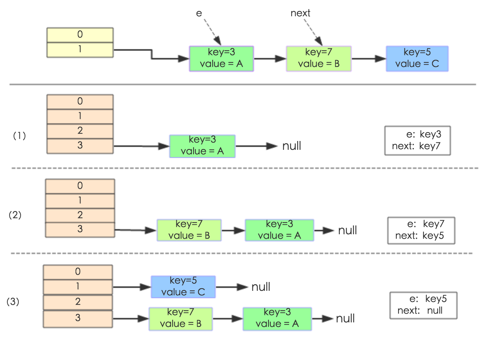
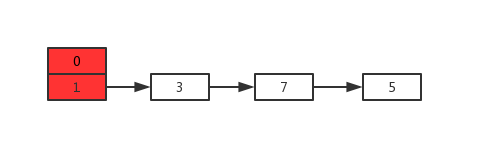
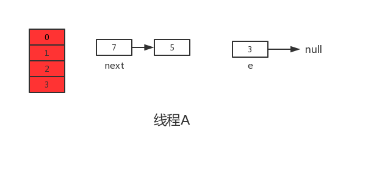
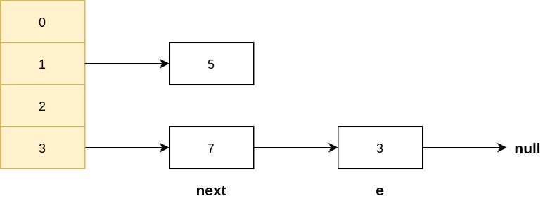
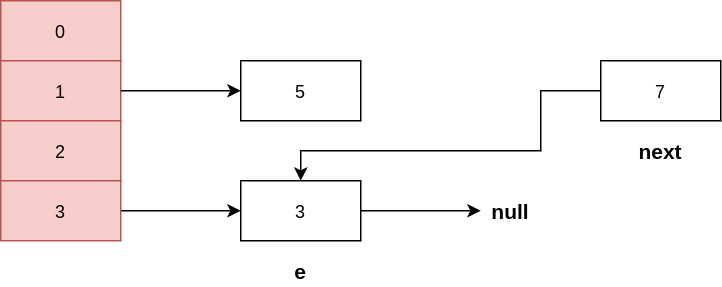

# Java

## static 修饰符

+ **综述**

  > 1. `static` 修饰的东西, 只会在`类加载`的时候初始化一次
  > 2. 常被用于 `不需要创建对象`即可使用类方法和访问类变量
  > 3. `static` 修饰的变量是可以修改的, 通常需要加 `final` 一起用

+ **修饰方法**

  > 1. 静态方法没有 `this` 指针
  > 2. 静态方法内无法调用`非静态的变量和方法`, 反过来可以. 因为非静态的变量和方法在`创建对象`的时候才会`初始化`

+ **修饰变量**

  > 1. 静态变量在内存中`只有一份`, 在`类加载` 的时候创建并初始化
  >
  > 2. 多个`对象` 共享一个`静态变量`
  >
  >    > 

+ **修饰代码块**

  > 1. `static` 也可以一次修饰多个语句, 常用于`批量初始化`变量
  >
  >    > ```java
  >    > class Test{
  >    >     private static final Integer a, b;
  >    >     static {
  >    >         a = 1;
  >    >         b = 2;
  >    >     }
  >    >     // 其他代码
  >    > }
  >    > ```

---

## 堆内存和栈内存

+ **综述**

  > 1. `堆内存`保存的是`对象的具体信息`, 通过关键字 `new` 开辟空间
  >
  > 2. `栈内存`保存的是一块`堆内存`的`地址`, 即保存 `引用`
  >
  > 3. `对象创建`和`引用传递`
  >
  >    
  >
  >    

---

## 垃圾空间

+ **综述**

  > 1. `垃圾空间` 是指没有任何`栈内存指向`的`堆内存空间`
  > 2. `垃圾空间` 会被 `GC(Garbage Collector)` 定期回收

---

## 对象向上和向下转型

+ **向上转型**

  + **例子**

    > ```java
    > // class Apple extend Fruit
    > Fruit fruit = new Apple();
    > ```
    >
    > 1. 此时 `fruit` 引用了 `Fruit` 的子类, 称为向上转型
    > 2. `fruit` 可以调用 `Apple 类` 中属于 `Fruit 类` 的属性和方法`( 如果方法被重写, 那么调用的是重写后的方法 )`.
    > 3. `fruit` 无法调用 `Apple 类` 中不属于 `Fruit 类` 的属性和方法

  + **应用**

    > ```java
    > //class Apple extend Fruit
    > class Test{
    >     public void main(){
    >         run(new Fruit());
    >         run(new Apple());
    >     }
    >     
    >     private void run(Fruit fruit){
    >         fruit.anymethod();
    >     }
    >     
    > }
    > ```
    >
    > 1. 上述例子通过 `向上转型` , 省去了 `run` 方法的重载.

+ **向下转型**

  + **例子**

    > ```java
    > // class Apple,Orange extend Fruit
    > Fruit fruit = new Apple(); //向上转型
    > Apple apple = (Apple) fruit; // (Apple) fruit 称为向下转型, 不会报错
    > 
    > Fruit fruit = new Apple();// 向上转型
    > Orange orange = (Apple) fruit; // 向下转型失败, 编译成功, 运行失败
    > ```

---

## 泛型( Generics )

+ **综述**

  > 1. `泛型` 是指 类, 接口或者方法使用 `类型(Types)` 进行初始化, 通常用于编写 `集合/容器` 类.

  > 1. `Java` 着重于`类型安全(Type Safe)`, 大部分 `类型错误` 会在`编译期`被发现, 但是如果使用`强制类型转换`, 这种错误很难在编译期发现.  
  > 2. `Java 5` 之前, 一般使用 `Object` 实现 `泛型` 功能, 但是需要使用 `强制类型转换`, 带来很大的 `安全隐患`.
  > 3. `Java 5` 之后, 引入 `<>` 的方法, 在编译期就可以发现`类型错误`.

+ **例子**

  > 1. **泛型类**
  >
  >    > ```java
  >    > public class Test<T> {
  >    >     private T val;
  >    >     
  >    >     public T getVal() {
  >    >         return val;
  >    >     }
  >    >     public T setVal(T val) {
  >    >         this.val = val;
  >    >     }
  >    > }
  >    > ```
  >    >
  >    > 
  >
  > 2. **泛型方法**
  >
  >    > ```java
  >    > // <Class> 是使用泛型的类(多是集合)
  >    > public <T> <Class><T> print(Test<T> a, Test<T> b){}
  >    > ```
  >    >
  >    > 

+ **通配符**

  + **综述**

    > 1. 通常用于 `泛型方法` 中传入参数

  + **用法**

    > 1. 上界通配符
    >
    >    
    >
    > 2. 下界通配符
    >
    >    

  + **例子**

    > ```java
    > // <Class> 是使用泛型的类(多是集合)
    > public <Class><? extends Number> print
    >     (<Class><? extends Number> a, 
    >      <Class><? extends Number> b)
    > ```

---

## 线程

### 线程综述

> 1. 线程之间共享的数据 : 在`主线程声明`的变量
>
> 2. 线程独有的数据 : 在`线程内声明`的变量
>
> 3. 线程有五种状态
>
>    
>
>    > 1. 调用 `new Thread()` 之后进入 `New`
>    >
>    > 2. 调用 `Thread.start()` 之后进入 `Runnable` , 随时接受 `CPU 调度`.
>    >
>    > 3. 接受 `CPU 调度` 后, 进入 `Running`
>    >
>    > 4. 线程暂时放弃 `CPU 的使用权` , 进入 `Blocked` , 其中 `Block` 分为三种
>    >
>    >    > 1. 调用 `Thread.wait()` 方法, 线程进入 `Wait Blocked`
>    >    > 2. 调用 `sleep() / join()` 方法, 或者发出 `I/O 请求` , 线程进入 `Other Blocked` . 当 `sleep()超时`、`join()等待的线程终止或者超时`,  `I/O处理完毕时`，线程进入 `Runnable` 
>    >    > 3. 线程获取 `Synchronized 锁` 失败, 进入 `Synchronized Blocked`
>    >
>    > 5. 执行完或者因为异常退出了 `Thread.run()` 方法, 则进入 `Dead`

### 线程可能存在的问题

+ **竞争态势 ( Race Condition )**

  > 1. 多个线程 `Check Then Act`
  >
  > 2. 多个线程 `Read Modify Write`
  >
  > 3. 多个线程 `不以原子性的形式` 访问数据
  >
  > 4. 数据更新的`可见性 ( Visibilty )`
  >
  >    > 1.  `CPU 更新数据`的时机是`不确定的( 处理完之后不一定立即写入 RAM )`
  >    > 2.  如果线程A `更新共享数据`到 **RAM** 之前, 线程B 从 **RAM** 中`读取了这个数据`, 则这个数据的`更新`对于 线程B 来说是 `不可见的`

+ **程序的执行顺序( Order )**

  > 1. JVM( JIT ) 会进行 `指令优化`
  > 2. 这可能会导致 `程序执行的顺序` 和 `CPU 最终执行指令的顺序`并`不一致`, 导致 `可见性` 被破坏

### 解决的方法

> 1. **Volatile** 和 **Synchronized** 和 **Lock** 等关键字的使用
>
> 2. **Happen-Before 原则** :  
>
>    > 1. 在 **线程 A** 执行 `Volatile Write/Synchronized Block` 之前的`变量更新`, 在 **线程 B** 执行 `Volatile Read/Synchronized Block` 之后都是`可见的`. 总的来说, 如果 `线程 A 新建了线程 B`, 则 `A 线程的变化总是 Happen Before 线程 B`.
>    > 2. **Volatile Write/Synchronized Unlock** `总是发生在` **Volatile Read/Synchronized Lock** `之前`
>
> 3. **总结的来说, Happen-Before 原则是对 `JVM( JIT ) 指令优化` 的`限制`.**

### Volatile

+ **综述**

  > 1. **CRUD**
  >
  >    > ```java
  >    > volatile int count = 0;
  >    > ```
  >
  > 2. **Volatile** 一般用于解决 `可见性` 问题
  >
  > 3. **Volatile** 不保证 `原子性` 
  >
  >    > ```java
  >    > public class Counter{
  >    >    private volatile int counter = 0;
  >    > 
  >    >    public void setCounter(int value)	{
  >    >         counter++;
  >    > 	}
  >    > }
  >    > ```
  >    >
  >    > > 此时如果多个线程拿到 **counter 变量**并调用 **setCounter** , 则 **counter 变量** 从 0 增加到 1, `而不是从 0 增加到 2`.

### Synchronized

#### 综述

> 1. **CRUD**
>
>    ```java
>    synchronized (Object monitor)
>    {<synchronized block>}
>    ```
>
> 2. **线程** 只有拿到 **monitor 对象** 才可以执行 `Synchronized Block` , 保证`同一时间` 只有`一个线程` 执行 `Synchronized Block`

#### 特性

+ **可重入性**

  > 拿到 **monitor 对象** 的线程可以执行 `同一 monitor 对象` 的全部代码块

+ **原子性**

  > 1. **Synchronized** 可以保证 **代码块** 的执行不会受到 `线程时间片轮询`的影响
  > 2. 即从代码块的**开始到结束**, `不会切换`到其他线程.

+ **公平性**

  > 不保证 `公平性`( 参考 **Starvation **问题 )

#### Monitor

> 1. **Monitor 对象**的划定
>
>    > ```java
>    > // 此时 Monitor 是 classA 实例化的对象
>    > class classA{
>    >     public void synchronized method(){}
>    >     public void method(){
>    >         synchronized(this){}
>    >     }
>    > }
>    > 
>    > // 此时 Monitor 是 classA 类
>    > class classA{
>    >     private static field;
>    >     public static synchronized method(){}
>    >     public method(){
>    >         synchronized(classA.class){}
>    >     }
>    > }
>    > 
>    > // 上述两者可以混合使用
>    > ```
>
>    

### Lock

+ **结构**

  

+ **综述**

  > 1. 同一时间, 只有 `拿到锁` 的线程可以执行相关代码
  >
  > 2. 需要 `显式` 地开关锁
  >
  > 3. **CRUD**
  >
  >    > ```java
  >    > 
  >    > ```
  >    >
  >    > 

+ **公平锁**

  > 1. 多个线程 `同时等待锁` 的时候, 如果不能保证`先等待的线程`先得到锁 , 则可能会有线程 `永远陷入等待的情况`, 称这种状态为 `Starvation( 饥饿 )`
  > 2. **公平锁** 保证`先等待`的线程`先得到锁`

+ **读写锁**

  > 1. 实现的 `读写线程分开`
  > 2. 多个线程`可以同时获得读锁`, 但`不能同时获得写锁`
  > 3. **读写锁** `同一时间只有一个`可以被获得

+ **可重入锁**

  > 1. 获得锁的线程可以 `再次获得同一个锁`

### ThreadLocal

+ **综述**

  > 1. **ThreadLocal** 可以存放 `只属于` 某个线程的 `数据`
  >
  > 2. **ThreadLocal** 通常用于**线程间**的` 数据隔离`
  >
  >    > 1. 为每个线程存放一个 **JDBC Connection**, 保证线程之间`不会关掉正在使用`的 **JDBC Connection**
  >
  > 3. **子线程** `可以拿到` **父线程** 的 `ThreadLocal 值`

### ExecutorService( Thread Pool )

#### 结构

+ **Thread Pool**


+ **ExecutorService**

  
  
+ **ExecutorService Implementation**

  

#### 综述

> 1. **ExecutorService** 底层使用 `Thread Pool` , 简化了多线程操作

#### ThreadPoolExecutor

> 1. **CRUD**
>
> 2. **工作流程**
>
>    > 1. 如果 `线程数 < corePoolSize`, `创建新的线程` 处理任务
>    > 2. 否则将任务放入 `workQueue` 中等待处理
>    > 3. 如果 `workQueue` 已满, 且 `maximumPoolSize > corePoolSize`, 则创建 `非核心线程` 处理任务
>    > 4. 如果 `总线程数量 > maxmunPoolSize`, 则使用 **RejectedExecutionHandler**处理任务
>    > 5. 当 `线程空闲时间 > keepAliveTime` , 则将 `非核心线程` 关闭

#### Executors

+ **综述**

  > 1. **CRUD**
  >
  >    > ```java
  >    > ExecutorService executorService = 
  >    > Executors.<ThreadPoolImplementation>();
  >    > 
  >    > // Future 用于掌握任务执行情况
  >    > Future<<return Type>> future = executorService.sumit(<Callable>);
  >    > 
  >    > // 永远使用 Try-Catch 处理 Future
  >    > try{
  >    >     <return Type> result = future.get();
  >    > }
  >    > catch 
  >    >     (InterruptedException | ExecutionException ignored)
  >    > {}
  >    > 
  >    > // 关闭 executorService
  >    > executorService.shutdown();
  >    > ```
  >    >
  >    > 
  >
  > 2. **Executors** 提供四种工厂方法新建
  >
  >    > 1. **CachedThreadPool**
  >    >
  >    >    > 1. 全部线程为 `非核心线程`, 数量无限
  >    >    > 2. 适合 `数量多, 时间短` 的任务
  >    >
  >    > 2. **ScheduledThreadPool**
  >    >
  >    >    > 1. 有 **核心线程** , 非核心线程 `无限多`
  >    >
  >    > 3. **SingleThreadPool**
  >    >
  >    >    > 1. `只有一条线程`
  >    >    > 2. 适合`顺序`执行任务
  >    >
  >    > 4. **FixedThreadPool**
  >    >
  >    >    > 1. `只有核心线程`

### Dead Lock ( 死锁 )

+ **发生的条件**

  > 以下四种情况`都满足时`, 死锁发生, 打破其中一种情况, 死锁解除
  >
  > > 1. **Mutual exclusion (互斥)**
  > >
  > >    > `资源被占用时`, 其他线程**不能使用**该资源
  > >
  > > 2. **Hold and Wait**
  > >
  > >    > 线程`请求使用` 其他资源时, `保持自身`已占有的资源
  > >
  > > 3. **No Preemption( 非抢占式 )**
  > >
  > >    > 资源**只能**由线程 `主动释放, 不允许抢占资源`
  > >
  > > 4. **Circuular Wait( 循环等待 )**
  > >
  > >    > A 占有 B, B 占有 C, C 占有 A

+ **解决方法**

  > 1. `重新排序`获得锁的顺序
  >
  >    > 1. 排序前
  >    >
  >    >    
  >    >
  >    > 2. 排序后
  >    >
  >    >    
  >
  > 2. **Timeout Backoff**
  >
  >    > 1. 线程 A `持有锁 A`, 尝试获得锁 B
  >    > 2. 如果线程 A 被阻塞, 则等待一段时间
  >    > 3. 如果超时, 则`线程 A 放弃锁 A`, 等待一段时间, 重试尝试获取锁 A,B
  >
  > 3. **检测死锁**
  >
  >    > 1. 根据线程和锁的关系 `构建图`
  >    > 2. 检测 `图是否有环`

### 阻塞队列( BlockingQueue )

+ **结构**

  

+ **综述**

  > 1. 以下情况的访问会被阻塞
  >
  >    > 1. `队列满了`的时候进行`入队列操作` 
  >    > 2. `队列空了`的时候进行`出队列操作`

+ **实现**

  > 1. **ArrayBlockingQueue**
  >
  >    > 1. 有界
  >
  > 2. **DelayQueue**
  >
  >    > 1. 有界
  >    > 2. 需要为队列中的元素指定`过期时间`
  >    > 3. 队列中的元素`根据过期时间排序`
  >
  > 3. **LinkedBlockingQueue**
  >
  >    > 1. 内部使用`链表实现`
  >    > 2. 不指定大小则为`无界`
  >
  > 4. **PriorityBlockingQueue**
  >
  >    > 1. 无界
  >    > 2. 根据元素`优先级排序`
  >
  > 5. **SynchronousQueue**
  >
  >    > 1. 只能存放一个元素

---

## 集合

### **Collection**

+ **综述**

  > 1. 全部`单值`存储容器都要 `实现的接口`
  >
  > 2. Colection 的 `CRUD` 示例 
  >
  >    > ```java
  >    > <List/Set><String> list/set = New <Collection 实现类><>();
  >    > 
  >    > list.add("a");//增
  >    > 
  >    > list.remove(0);//删
  >    > 
  >    > list.set(0,"A");//改
  >    > 
  >    > list.get(0);//查
  >    > 
  >    > Collections.sort(list);//排序, 字符串根据 ASCII
  >    > Collections.max(list);// 找到最大值
  >    > Collections.min(list);// 找到最小值
  >    > 
  >    > //for-each遍历, 遍历中无法删除元素
  >    > for (String s: list/set){
  >    > System.out.println(s);
  >    > }
  >    > 
  >    > //迭代器遍历, 遍历中可以删除元素
  >    > Iterator<String> iterator = list/set.iteator();
  >    > while (iterator.hasNext()){
  >    >  iterator.next();
  >    >  iterator.remove(); //使用迭代器删除元素
  >    > }
  >    > 
  >    > //输出全部值
  >    > System.out.println(list/set);
  >    > ```
  >    
  > 3. 单线程 `迭代` 的过程使用 `<Collection 实现类>.remove()` 会出现并发更新异常. 需要使用 `Iterator.remove()` 

---

## JVM ( Java Virtual Machine )

### JVM 的内存模型 ( 线程的角度 )

+ **结构**

  

+ **综述**

  > 1. `堆` 是**全部线程**和 **CPU核心** `共用`的, 存放的是变量`具体的值`
  >
  > 2. `栈` 是`线程独有`的, 存放的是在`线程内声明` 的变量的`引用`, 存放堆中对应的内存地址
  >
  > 3. 多线程下的内存模型 : 每个线程都有`自己的 CPU`,  RAM 是`全部线程共用`的.
  >
  > 4. `CPU` 处理数据流程
  >
  >    > 1. `CPU 处理单元` 从`缓存`取数据到`寄存器`
  >    > 2. 没有则从 `RAM( 栈-->堆 )` 中`复制`一份数据到`CPU ( 缓存 --> 寄存器)`中
  >    > 3. `CPU 计算单元`处理完之后`更新堆中的数据

### JVM 指令优化

+ **指令并行优化**

  > 1. CPU 指令`并行优化`
  >
  >    > 1. CPU 会从`待执行的指令队列`中找出 `可以并行`的指令 
  >    > 2. 将`可以并行` 的指令放在不同的流水线执行, 加速 **CPU** 运行速度.
  >
  > 2. JVM( JIT ) 指令 `并行优化`
  >
  >    > 1. JVM ( JIT ) 在`编译阶段`找出`可以并行`的指令
  >    > 2. 将指令`重新排序`之后再输入 **CPU**

## 逻辑运算符

+ **与**

  + **&&**

    > 1. 短路与
    >
    >    > 1. 有 **A && B**, 如果 A 为假, `则不执行 B`
    >    >
    >    > 2. 则  `B 被短路了`
    >    >
    >    > 3. 此时整个表达式为假
    >    > 4. 如果 **A** 为真, 则继续执行 **B**

  + **&**

    > 1. 逻辑与
    >
    >    > 有 A & B, 此时两个表达式 `都会执行`
    >
    > 2. 按位与
    >
    >    > 有 A & B, 如果 A 和 B 都不是表达式, 则执行`按位与`

+ **或**

  + **||**
  + **|**


# 八股文

## 强引用、软引用、弱引用、幻象引用

### 用处

> 1. **GC 内存回收**的基本原理是 `回收对象`
> 2. 实现的算法一般是 **可达性分析** 和 **引用计数法**, 但是后者不能解决互相引用的问题
> 3. 所以 **JAVA** 提供了四种引用, 方便 `GC`

### 强引用

+ **综述**

  > 1. **强引用** 指向的对象, `不会被 GC`
  >
  >    > 除非被 `显式的赋值为 NULL`
  >
  > 2. 用 `new` 关键字创建的对象都是 `强引用` , 其他的引用通过库创建

### 软引用

+ **综述**

  > 1. 在即将耗尽内存的时候, **软引用**指向的对象 `会被 GC`
  >
  > 2. 一般用于实现 `缓存`
  >
  >    > 当内存不足时, 缩小缓存
  >
  > 3. 使用 `SoftReference` 类创建

### 弱引用

+ **综述**

  > 1. 当启动 **垃圾回收** 时, 改类引用会被 `立即回收`
  > 2. 一般用于实现 `缓存`
  > 3. 使用 `WeakReference` 类创建

### 幻象引用

+ **综述**

  > 1. 一般用于 `跟踪对象被垃圾回收的状态`, 必须和 `引用队列` 联合使用
  > 2. 使用 `PhantomReference` 类创建

## String、StringBuffer、StringBuilder

#### 字符串常量池

+ **综述**

  > 1. 当使用 **直接量赋值** 的时候, 检查池中是否有值相同的字符串.
  >
  >    ```java
  >    String s1 = "asdfa"; // 直接量赋值
  >    String s2 = new String("FADFSD"); // 不检查且不放入池中
  >    ```
  >
  >    
  >
  > 2. 如果有, 则 `返回引用`; 没有, 则创建并将引用 `放入池中`

### String

+ **综述**

  > 1. 一旦生成就 `不可以改变` 
  > 2. 所以是线程安全的

### StringBuffer / StringBuilder

+ **综述**

  > 1. 可以改变的字符串
  >
  > 2.  **StringBuffer** 是 `线程安全` 的, **StringBuilder **不是
  >
  >    > **StringBuffer** 的方法全部使用 `synchronized` 修饰
  >
  > 3. 底层是可修改的 `( char , JDK 9 以后是 byte ) 数组`

## Vector、ArrayList、LinkedList

> 1. **前两者**使用 `数组实现`, **后者**使用 `双向链表` 实现
>
> 2. **Vector** 是 `线程安全` 的, 其他不是
>
> 3. 前两者的 `访问快, 插入和删除慢`; 后者 `插入快, 访问和删除慢`
>
>    > 1. 前两者 **插入删除尾部元素** 也是快的
>    > 2. 因为不会触发 `扩容和缩容` 

## Hashtable、HashMap、TreeMap

### **综述**

> 1. **HashTable** 早期使用, 目前多用 **HashMap**
>
>    > HashTable 是线程安全的, 实现方法是把 `put, get ,size` 等方法加锁
>
> 2. **HashMap**
>
>    > 1. 支持 `null 键值`
>    > 2. **无序存储**
>    > 3. **插入和访问** 的复杂度为 `常数`
>
> 3. **TreeMap**
>
>    > 1. 不支持 `null 键值`
>    >
>    >    > 1. 因为需要实现 `Comparable 或 Comparator` 接口
>    >
>    > 2. **有序存储**, 但是是通过 `键的顺序` 排序的
>    >
>    > 3. **CURD** 的时间复杂度为 `log(n)`
>    >
>    >    > 1. 因为底层使用 `红黑树` 实现

### HashMap 设计与实现

#### 前情提要

> 1. **equals 方法**
>
>    > 1. 没有覆写, 则比较两个对象的 `地址` 是否相等
>    >
>    > 2. 覆写后, 用于比较两个对象的 `值` 是否相等
>    >
>    >    ```java
>    >    int a=1;
>    >    int b=1;
>    >    
>    >    // 没有覆写
>    >    a.equals(b); // 结果为 false
>    >    
>    >    // 覆写为比较两个对象的 值
>    >    a.equals(b); // 结果为 true
>    >    ```
>    >
>    >    
>
> 2. **hashCode 方法**
>
>    > 1. 输入对象的 **地址**, 输出 `一个整数`
>    >
>    >    > 1. 一般的来说, 就是把 **任意长度的输入, 变换为固定长度的输出**
>    >
>    > 2. 不同的输入可能会 `导致相同的输出`
>
> 3. 两者在 **HashMap** 中的约束
>
>    > 1. **equals()** 相等, 则 **hashCode()** 也要相等
>    >
>    > 2. 重写 **hashCode()** , 也要重写 **equals()**
>    >
>    >    > 因为 **equals()** 默认情况和 **hashCode()** 一样

#### 阈值( threshold )和负载因子( loadFactor )

+ **源码**

  ```java
  // HashMap 中 初始化操作的字段
  int threshold;
  final float loadFactor;
  int modCount;
  int size;
  ```

  

+ **讲解**

  > 1. **threshold** 代表 **hashMap** 可以容纳的最大键值对数量( 包括`拉链存储`的键值对 )
  >
  >    ```java
  >    threshold = length * loadFactor;
  >    ```
  >
  > 2. **loadFactor** 是对`空间和时间`的一个取舍
  >
  >    > 1. **loadFactor** 越小, 说明越早进行扩容, 即 hashMap 越大, 发生 `哈希冲突` 的概率就越小, 即性能越好. 属于空间换时间
  >    > 2. **loadFactor** 越大, 则与上述相反
  >
  > 3. **length** 是 hashMap 实际长度( 不包括`拉链存储` 的键值对 )
  >
  >    > 1. **length** 初始化为 16
  >    >
  >    > 2. **length** 一定是 `2 的 n 次方`, 且每次扩容为原来大小的`两倍`
  >    >
  >    >    > 1. 常规的方法是设置 **length** 为 `素数`, 因为素数比合数发生哈希冲突的`概率要小`
  >    >    > 2. 设置 **length** 为 2的n次方, 主要是方便取模和扩容.
  >    >    > 3. 同时, 为了减少 哈希冲突 的概率, java 对 `哈希寻址` 做了优化
  >
  > 4. **size** 是 **hashMap** 中 `实际存储` 的键值对数量, 与 **length** 需要区分
  >
  > 5. **modCount** 是 **hashMap** 结构发生变化的次数, 比如新增键值对

#### 寻址

+ **示意图**

  

+ **主要步骤**

  > 1. 计算 **Key** 的 `hashCode` 
  >
  > 2. **高位运算 + 异或运算**, 得到新的 `hashCode`
  >
  > 3. 最后进行 `取模运算`, 得到最终的地址
  >
  >    > 1. 因为 **length** 总是 **2的n次方**, 所以对 **length-1** 的`按位与` 运算等价于 `取模运算`
  >    >
  >    >    ```java
  >    >    // 当且仅当 b为2的n次方时成立
  >    >    a % b == a & (b - 1);
  >    >    ```
  >    >
  >    >    
  >    >
  >    > 2. 但是 `按位与` 运算比 `取模运算` 更快

+ **源码**

  ```java
  static final int hash(Object key) {
      int h;
      
      // 计算一次 hashCode, 然后右移16位( 取高位数值 )
      // 将原来的 hashCode 与右移的 hashCode 做 异或运算
      // 得到最终的 hashCode
      return (key == null) ? 0 : (h = key.hashCode()) ^ (h >>> 16);
  }
  
  // 取模运算, 根据 hashCode 得到实际在 hashMap 中的位置
  static int indexFor(int h, int length) {
       return h & (length-1); 
  }
  ```


#### 插入

+ **示意图**

  

+ **主要步骤**

  > 1. 如果该位置 `没有元素` , 则直接插入
  > 2. 如果有元素, 则逐个元素调用 `equals()` 方法
  > 3. 返回 **true** 则 `直接覆盖` ; 返回 **false** 则在 `尾部插入`
  > 4. 如果链表长度 大于**8**, 则 `树化为红黑树`, 然后插入
  > 5. 如果插入后 **size > threshold** , 则扩容

+ **源码**

  ```java
  public V put(K key, V value) {
      
      // 对 key 的 hashCode() 做 hash
      // 然后使用 putVal
      return putVal(hash(key), key, value, false, true);
  }
  
  final V putVal(int hash, K key, V value, boolean onlyIfAbsent,
                 boolean evict) {
      
      Node<K,V>[] tab; Node<K,V> p; int n, i;
      
      // 1.lazy-Load, 即 真正放入元素时 才初始化 hashMap
      if ((tab = table) == null || (n = tab.length) == 0)
          n = (tab = resize()).length;
      
      // 2.计算地址, 如果该位置为空
      //   即没有相同的 Key, 则直接插入
      if ((p = tab[i = (n - 1) & hash]) == null)
          tab[i] = newNode(hash, key, value, null);
      
      else {
          Node<K,V> e; K k;
          
          // 3.如果存在相同的 Key 和 Value ,则直接覆盖
          if (p.hash == hash &&
              ((k = p.key) == key || (key != null && key.equals(k))))
              e = p;
          
          // 4. 否则判断是否为 红黑树
          // 	  是则插入到树中
          else if (p instanceof TreeNode)
              e = ((TreeNode<K,V>)p).putTreeVal(this, tab, hash, key, value);
          
          else {
              
              // 5. 否则遍历链表, 查看是否存在相同的 Value
              for (int binCount = 0; ; ++binCount) {
                  if ((e = p.next) == null) {
                      p.next = newNode(hash, key, value, null);
                      
                      // 链表长度大于8, 转换为红黑树
                      if (binCount >= TREEIFY_THRESHOLD - 1)
                          treeifyBin(tab, hash);
                      break;
                  }
                  
                  // 存在相同的 Key 和 Value
                  // 则直接覆盖
                  if (e.hash == hash &&
                      ((k = e.key) == key || 
                       (key != null && key.equals(k))))
                      break;
                  
                  // 不存在则在尾部插入
                  p = e;
              }
          }
          if (e != null) { // existing mapping for key
              V oldValue = e.value;
              if (!onlyIfAbsent || oldValue == null)
                  e.value = value;
              afterNodeAccess(e);
              return oldValue;
          }
      }
      ++modCount;
      
      // 超过最大容量 就扩容
      if (++size > threshold)
          resize();
      afterNodeInsertion(evict);
      return null;
  }
  
  ```

  


#### 扩容

+ **示意图( JDK1.7 )**

  

  > 1. 链表在扩容之后发生 `倒置` , 因为 **Java7** 采用的是 `头插法`, **Java8** 不会
  > 2. 每一个元素都要进行 `重新哈希` , 比较耗时. **Java8** 采用比较巧妙的方法解决此问题

+ **不需要重新哈希的方法**

  

  > 1. **length** 总是 2的n次方, 即当发生扩容时, length 只会增加一位 1
  >
  >    ```java
  >    1111(16) --> 0001 1111(32)
  >    ```
  >
  > 2. 那么, 只需要根据元素 **原来的哈希值** 在 **length** 新增加的那一位 `是否为 1`, 即可判断该元素 `是否需要移动位置( 1则需要移动, 0 则不需要)`
  >
  > 3. 如果需要移动, 那么
  >
  >    ```java
  >    // 因为 newIndex = hash & (length - 1)
  >    // hash 是不会变的, 
  >    // 那么 newIndex 只跟 length - 1有关
  >    newIndex = oldIndex + oldCap;
  >    ```
  >
  >    

  

#### 线程安全问题

##### **JDK 1.7**

+ **源码**

  ```java
  void transfer(Entry[] newTable, boolean rehash){
      int newCapacity = newTable.length;
      for (Entry<K, V> e : table){
          while(e != null){
              
              // 储存当前结点的下一个结点
              // 因为之后会 断开 当前结点的 指向
              Entry<K, V> next = e.next;
              
              if(rehash){
                  e.hash = null == e.key ? 0 : hash(e.key);
              }
              
              // 计算新的储存位置
              int i = indexFor(e.hash, newCapacity);
              
              // 若该位置为空, 则当前元素指向 null : null 结点
              // 否则指向该位置存储的元素
              // 相当于插入已有结点的前面, 即"头插法"
              e.next = newTable[i];
              newTable[i] = e;
              
              // 注意!!!
              // 链表中的整个结点是不可能被覆盖的, 只能覆盖结点的值
              // 当没有任何引用指向结点, 和结点不指向任何结点时
              // 该结点会被垃圾回收, 称为 "删除结点"
              
              // 相当于普通循环中的 i++
              e = next;
          }
      }
  }
  ```

  

+ **死循环**

  > 1. 此时 **线程 A** 和 **线程 B** `同时触发`扩容机制
  >
  >    
  >
  > 2. **线程 A** 将 **3** 解除指向, 此时操作系统 `进行了时间片轮询`
  >
  >    
  >
  > 3. **线程 B** 完成了整个扩容, 此时操作系统 `进行了时间片轮询`. 
  >
  >    注意, 对于 **线程 A** 来说, `e = 3,  e.next = null, next = 7 , next.next = 3`
  >
  >    
  >
  > 4. **线程 A** 继续进行扩容, 将 **3** 又插入了链表的头部.
  >
  >    
  >
  > 5. 进入下一轮循环, 更新 `e = 7, next = 3` , 又将 **7** 插入链表头部
  >
  >    .png)
  >
  > 6. 进入下一轮循环, 更新 `e = 3, next = null`, 又将 **3** 插入链表头部, 形成的 **3** 和 **7** 互指的场面, 即链表有环.
  >
  >    .png)
  >
  > 7. 下一次进行查询时, 将会出现 `死循环`

##### JDK 1.8

+ **源码**

  ```java
  final V putVal(int hash, K key, V value, boolean onlyIfAbsent,
                 boolean evict) {
      
  	//......
      
      // 计算地址, 如果该位置为空
      // 即没有相同的 Key, 则直接插入
      if ((p = tab[i = (n - 1) & hash]) == null)
          
          // 如果该位置存在结点
          // 会使原来的结点即不指向任何结点, 也没有结点指向它
          // 即该节点被删除了
          tab[i] = newNode(hash, key, value, null);
      
      //.....
  }
  
  ```

  

+ **数据丢失问题**

  > 1. 当 **线程 A**  对 **位置 1 ( 原本没有数据 )** 进行数据插入时, 操作系统 `进行时间片轮询`
  > 2. **线程 B** 对 **位置 1** 完成了数据插入, 操作系统 `进行时间片轮询`
  > 3. 此时 **线程 A** 对 **位置 1** 完成数据插入, 覆盖了 **线程 2 的数据**


## ConcurrentHashMap