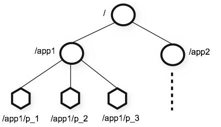
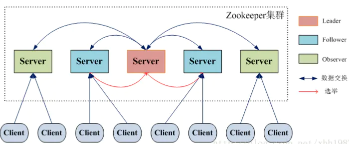

# 综述

*Zookeeper 是一个分布式的 **共识组件** . 也就是说, 它本身是分布式的, 同时它也被用在很多分布式系统中, 比如 Hadoop , Kafka...... 根据它的设计来说( 数据存储在内存中 ), zookeeper适用于 **读多写少** 的应用场景中, 并且保证 **最终一致性 和 分区容错性( CP )***

# 架构

1. 架构形如一个树, 层次类似 ***文件系统***

# 结点和监听

1. 结点分为 ***持久化结点, 暂存结点, 顺序结点***

2. 每一个结点都由 **全局唯一** 的名称标记, 可以存放一定量的信息 ( 官方推荐 <1M )

3. 持久化结点, 顾名思义, 一旦创建, 除非主动删除, 否则一直存在

4. 暂存结点, 由客户端主动创建, 当客户端断开连接之后, 自动删除

   > 可以用于实现分布式锁

5. 顺序结点, 即每一次创建结点, 都会由 zookeeper 负责加上一个序号前缀, ***保证在同一个父结点下, 该序号单调递增***

   > 同样适用于分布式锁

6. **客户端** 可以在结点上注册监听, 当结点发生某些变化( 新增结点, 结点删除...... ), 客户端可以立即感知这些变化

# 集群容灾

1. 每一个 Server 都可以处理 **读操作( 但是不能保证是最新的 )**, 遇到写操作, 会把它转发到 Leader 上
2. ***只有 Leader 可以处理写操作***, 并且每一个写操作都是 串行执行的, 也就是说, zookeeper **不支持并发写**. Leader 会将写操作广播到集群中, 如果有半数的 Server 响应写入成功, 则此次写操作成功.
3. Observer 不参与到上述行为, 也不参与选举, 仅负责读操作和转发写操作