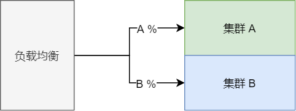
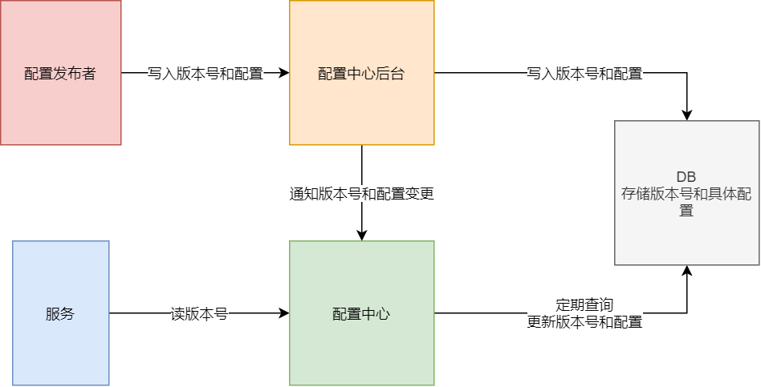

# 分布式配置中心综述

## 用途

### 如果没有配置中心 - 单机

#### 什么是单机应用 ( SOA ) - 应用和服务紧耦合

> 1. 应用的 **全部服务( eg. 支付, 订单, 日志......** `部署在一台机器上`
> 2. **配置 ( eg. 数据库参数, 端口, 线程池属性...... )** 通常写在 `配置文件` 里面, `和应用一起部署` 
>
> .png)

#### 没有配置中心的缺点 - 配置和应用紧耦合

> 1. 不利于`上线后` 进行 **拓展**, 因为如果 **需要拓展** , 则需要 `重复部署一模一样的配置`
>
>    
>
> 2. 不利于`上线后` 进行 **配置修改**, 因为如果 **需要修改** , 则需要 `手动修改每一个应用`

---

### 使用配置中心 - 微服务

#### 什么是微服务 - 应用和服务松耦合

> 1. 应用的 **全部服务( eg. 支付, 订单, 日志......** `分别部署在不同的机器上`
> 2. 配置由 `配置中心( 在独立的一台机器上 )` **统一管理** 
> 3. `可选择` 地拓展应用的服务 **( eg. 只拓展支付或者订单服务 )**
>
> .png)

#### 使用配置中心的优点 - 配置和服务松耦合

> 1. `上线后` 进行应用拓展 `不需要重复部署配置文件` 
> 2. `上线后` 进行配置修改 `不需要重复修改配置文件` 
>
> .png)

---

## 配置的发布策略

### 为什么需要发布策略

> 1. 发布 == 发布修改
> 2. 应用 **上线后修改** , 使用正确的 `发布策略` , `最小化影响 ` 正在 **运行的应用**

---

### 蓝绿发布

#### 什么是蓝绿发布

> 1. 将集群分为 **A, B** 两部分, 并将 `流量导向 A`
>
>    .png)
>
> 2. **B** 执行修改, `修改完成并通过测试`后, 将 `流量导向 B`
>
>    .png)
>
> 3. **A** `修改完并通过测试`后, 两者又重新作为 `一个集群服务`
>
>    .png)

#### 优缺点

> 1. 升级/回滚 `速度快速`
> 2. 需要`两倍的机器数量`做升级

---

### 灰度发布 - 金丝雀发布

#### 什么是灰度发布

> 1. 集群分为 **A, B** 两部分, 同时调整 **流向两部分** 的 `流量比例`
>
>    > 1. 其中 **A** `为旧版本应用`, **B** 为 `更新完成的应用`
>    > 2. 流向 **B** 集群的流量较少
>
>    
>
> 2. 不断从 **A** 中取出机器并更新, 然后 `加入 B 中`, 同时 `调整 A, B 的流量比例` 
>
>    .png)
>
> 3. 重复上一步骤, 直到全部机器更新完成
>
>    .png)
>
> 

#### 优缺点

> 1. **自动化**要求高
> 2. 会影响 `一部分用户的体验`

---

### 滚动发布

#### 什么是滚动发布

> 1. 每次从集群中 `取出一部分机器` , 进行修改测试
>
>    .png)
>
> 2. 通过后`放回集群中`, 并重复上述步骤
>
>    -1625731030388.png)
>
> 3. 直到集群中 `全部机器修改完成`
>
>    -1625731034579.png)

#### 优缺点

> 1. 自动化要求比 `灰度发布` 更高

---

## 分布式配置中心架构

### 携程

#### 讲解

> 1. `读写分离` 的架构
>
> 2. 配置发布者发布新配置到 `配置中心后台` , 后者同时发布到 `配置中心` 和 `DB`
>
>    > 1. 发布到两个地方, 这样即使 **其中一个发布失败,** 还是可以通过另外一种方式实现发布
>
> 3. 服务 `启动的时候` 拉取配置, 之后采用 `长轮询` 的方式实现 **热更新**
>
> 4. 通过 `版本号` 实现 **环境控制, 追踪, 回滚** 等功能