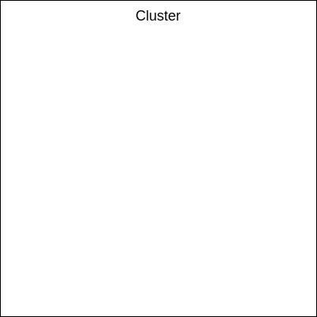
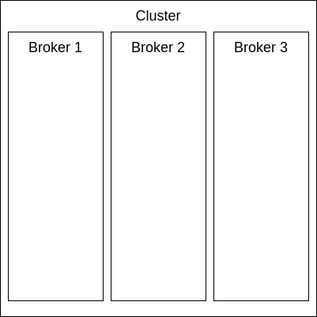
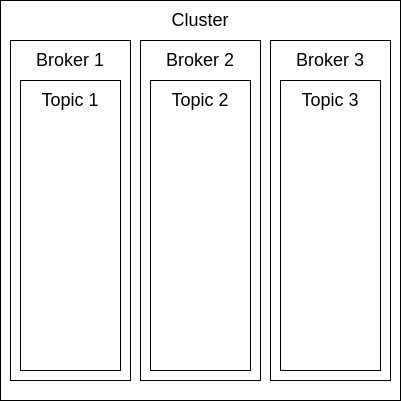
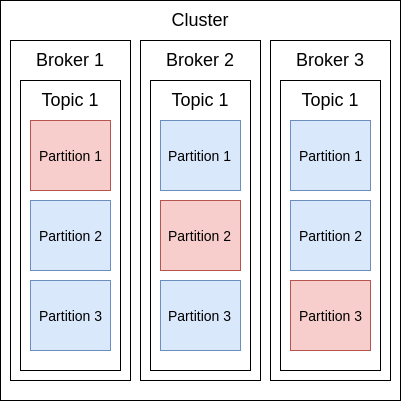

# Kafka

[toc]

## 综述

> `Kafka` 是一个 `分布式` 的 `流数据` 处理平台

## **Cluster( 集群 )**

+ **综述**

  > 1. 一个 `Cluster` 由多个 `Broker` 组成

## **Broker ( 服务器 )**

+ **综述**

  > 1. 一个 `Broker` 一般在 `一台机器` 上
  > 2. 一个 `Broker` 由一个或多个 `Topic` 组成
  > 3. `Broker` 负责 `处理请求( 消费者, 生产者, 元数据 )` 和 `维护数据备份`

## **Topic ( 主题 )**

+ 综述

  > 1. 负责 `保存数据`
  > 2. 生产者和消费者将数据 `写入 Topic`
  > 3. 数据不能主动删除, 只能通过 `新建同名 Topic` 删除数据
  > 4. `Topic` 负责维护 `Consumer` 的读写记录( 位置 ), `Consumer` 可以 `自主选择` 读写的位置

## **Partition( 分区 )**

+ **综述**

  > 1. 一个 `Topic` 由一个或多个 `Partition` 组成
  > 2. `Partition` 内使用 `队列` 储存数据
  > 3. `Partiton` 存在 `Leader( 主 )` 和 `Followers( 从 )`. 主分区负责 `读写`, 从分区负责从主分区 `同步信息`
  > 4. 当 `主分区` 失效时, `zookeeper` 会推举出主分区, 所以尝试将主分区 `分布在不同的 Broker 上`

## **Consumer Group( 消费者组 )**

> 1. `一个 Partiton` 只能被 `一个 Consumer Group` 里面的`一个 Consumer` 消费
> 2. 但是`一个 Consumer Group`里面的 `一个 Consumer` 可以同时消费 `几个 Partition`

## **队列(Queue) 和 广播(Pub/Sub)**

> `Kafka` 可以实现 `队列和广播` 两种消息模式

+ **队列 ( Queue )**

  + **结构**

    

  + **讲解**

    > 1.  `Partion( 分区 )` 只能被 `一个 Consumer Group(消费者集群)` 里的 `一个 Consumer(消费者)` 消费
    > 2.  反过来 , `一个 Consumer(消费者)` 可以同时消费 `多个 Partion(分区)`

+ **广播( Pub/Sub )**

  + **结构**

    

  + **讲解**

    > 1. `Partion(分区)` 可以被 `不同的 Consumer Group(消费者集群)` 里面的 `Consumer(消费者)` 同时消费

## Replications 管理

> 前情提要 : ***Kafka*** 所有的容灾都做在 ***分区( Partition )*** 这个层级上

### 名词介绍

*AR ( All Replications )* : 所有分区的 Replication 

*ISR ( In Sync Replications )* : 保持同步的 Replication

*OSR ( Out Sync Replications )* : 滞后/脱离同步的 Replication

***AR = ISR + OSR***

# 消费者组 Rebalance