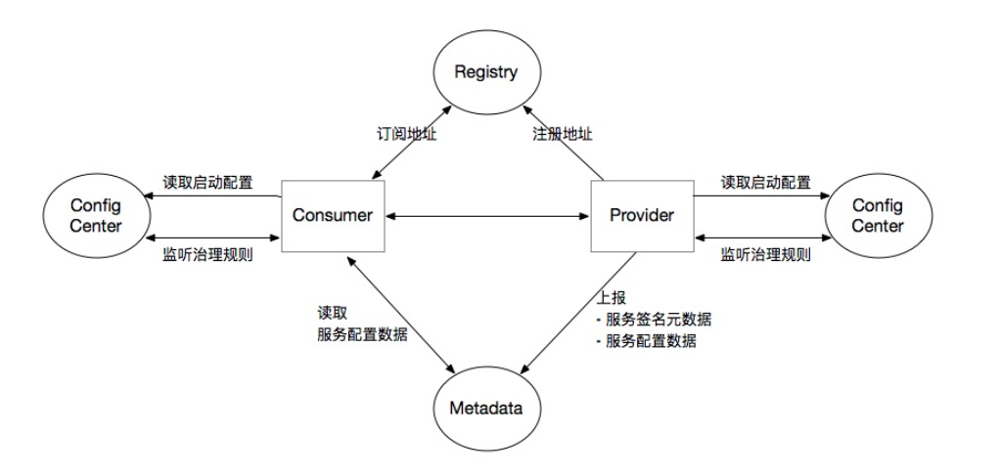

# 综述

*微服务框架, 包含成熟的 **RPC 通信** 和 **微服务治理** 功能*

# 架构

1. 负载均衡做在了客户端

2. 注册中心( Registry ) 只存储服务的 **基本信息**, 包括 IP 地址, 端口, 名称等

3. 元数据中心 ( Metadata ) 存储服务的 **具体信息**, 包括接口数量, 接口参数等

4. 完整的调用流程

   > 1. 客户端订阅注册中心 ( 长连接推送改变 ), 获得服务的 **基本信息**
   > 2. 根据 **基本信息** 到 元数据中心 拿接口信息
   > 3. 发起调用

# 注册中心

1. 可以选用 Zookeeper, Consul, Nacos 等组件, 只提供了接入, ***集群需要自己搭建***

# 元数据中心

1. 

# 配置中心