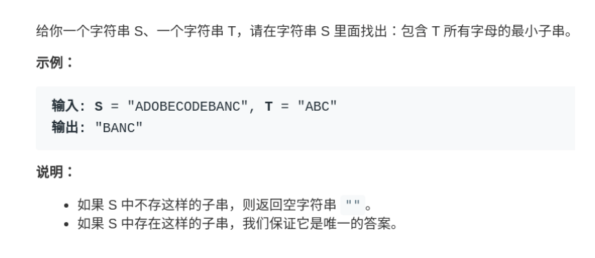

# 双引用

+ **左右引用**

  + **二分查找**

  + **在有序数组中寻找给定的两数之和**

    ```java
    // 输入 : 有序数组, 目标和
    // 输出 : 两个数的位置
    int[] twoSum(int[] nums, int target) {
        
        // 初始化 左右引用
        int left = 0, right = nums.length - 1;
        
        while (left < right) {
            int sum = nums[left] + nums[right];
            
            // 找到则返回两数位置
            if (sum == target) {
                return new int[]{left, right};
            } 
            
            // 如果两数之和 比目标小
            // 则左引用 右移一位
            else if (sum < target) {
                left++; // 让 sum 大一点
            } 
            // 如果两数之和 比目标大
            // 则右引用 左移一位
            else if (sum > target) {
                right--; // 让 sum 小一点
            }
        }
        
        // 没找到则返回 -1
        return new int[]{-1, -1};
    }
    ```

    

  + **翻转数组**

    ```java
    void reverseString(char[] arr) {
        
        //初始化左右引用
        int left = 0;
        int right = arr.length - 1;
        
        while (left < right) {
            // 交换 arr[left] 和 arr[right]
            char temp = arr[left];
            arr[left] = arr[right];
            arr[right] = temp;
            
            // 收缩翻转范围
            left++; right--;
        }
    }
    ```


# 递归

## 1. **综述**

*递 :* 程序 **进入下一个栈帧**, 每一个栈帧都有 **自己的局部变量**, 要想在栈帧之间建立联系, 需			要通过 `全局变量` 或者 `入口参数`

*归 :* 程序退出当前栈帧, 返回上一个栈帧


## 2. **链表递归技巧**

*倒着想 :* 对于链表来说, 前序遍历的部分( **进入递归前的部分** ) `通常不做操作, 仅仅是判断条件`, 后序遍历的部分( **上一个栈帧退出的地方** ) **才是** 编写具体操作的地方. 整体来看, 程序编写的思路是从 **链表的尾部开始往头部前进**, 而不是 **从链表的头部往尾部( 迭代的思路 )**


## 3. **二叉树递归技巧**


# 动态规划

## 1. **综述**


> 1. 动态规划一般用于解决 `一个问题可以分解为多个子问题` 的情况， 并且通常用于求最值
> 2. 因为有 `DP Table` , 所以动态规划是 `自底向上` 解决问题的, 并且一般使用 `迭代(而不是递归)` 解决问题

## 2. **DP Table 和重叠子问题**


> 1. 动态规划一般存在`重叠子问题`, 会导致 `重复计算`. 
>
> 2. 将子问题的`计算结果储存起来( DP Table )`, 避免**重复计算**, 本质是`对递归树剪枝`
>
> 3. `DP Table` 可以存储**全部子问题**的结果, 也可以**只存储一部分**的, 后者称为 `状态压缩`
>
> 4. `DP Table` 可以是多维的, 取决于对问题的抽象程度
>
>    ```java
>    // DP Table 的索引是状态变量的值
>    // 存储的值是 f(n)
>    n = {i,j,k};
>    dp[i][j][k] = f(n);
>    ```
>   ```
> 
>   ```

## 3.**状态转移方程**

> 1. 状态转移方程用于描述问题, 拥有`初始值(base case)`和`状态变量( n )`
>
>    

## 4. **最优子结构**

## 5. **一般流程**

> 1. 明确 状态变量, **即确定 n**
>
>    > 1. 非常重要, 不同的问题有不一样的抽象方式
>
> 2. 明确 状态方程, **即 f(n) = 什么**
>
> 3. 确定 base case, **即 f( n ) = 常数的时候**
>
> 4. 写出 状态转移方程, **即写出 f(n) **
>
> 5. 明确 选择, **即什么会导致 n 变化**
>
> 6. 求解 `DP Table`


# 回溯/深度优先算法( DFS )

## 综述

> 1. **DFS(Depth First Search )** 算法, 即 **深度优先** 算法, 也被称为 **回溯** 算法
> 2. 通常用来 `暴力穷举` 所有的可能
> 3. 本质上来说, 是将问题抽象为 `一颗决策树` , 然后在这个树上进行 `前序遍历和后序遍历`

## 决策树

+ **示意图**

  

  > 图为 `全排列问题` 抽象的决策树, 第一个结点为空

+ **综述**

  > 1. 当使用 **DFS** 算法时, 一般来说需要记录几个变量
  >
  >    > 1. **路径** --> 记录遍历时 `经过的全部结点`, 一般是 `前序遍历` 之前做选择.
  >    > 2. **选择列表** --> 根据 `当前结点` 的位置, 可以供选择遍历的 `下一个结点的列表` 
  >    > 3. **结束条件** --> 到达树的底层即返回, 一般是 `选择列表为空的时候`
  >
  > 2. 对于决策树来说, **前序遍历的代码** 在 `进入节点之前` 的那个时间点执行，**后序遍历代码** 在 `离开节点之后` 的那个时间点执行

## 代码框架

```java
// 全局变量, 用来储存结果
result = [];

def backtrack(路径, 选择列表):

	// 当满足递归结束条件时
	// 储存结果, 并退出当前帧栈
    if 满足结束条件:
        result.add(路径);
        return;
    
    // 暴力枚举全部可能
    for 选择 in 选择列表:

		// 在递归之前( 前序遍历 )做选择, 
		// 即在 进入下一个结点之前 做选择
		// 即 在 路径 中 储存当前选择
        做选择;

		// 开始递归枚举全部可能
        backtrack(路径, 选择列表);

        // 在递归之后( 后序遍历 )撤销选择, 
		// 即在 离开结点的时候 撤销选择,
        撤销选择;

```


# 数组

## 原地删除元素 - 快慢引用

```java
    /**
     * 快慢引用算法
     * @param nums 数组
     * @param val 要删除的元素
     * @return 删除给定元素后数组的大小
     * 例子 : 数组 = {1,2,3,3,4} , 要删除的元素 = 3, 
     * 删除给定元素后的数组 = {1,2,4,3,3}, 数组大小 = 3
     */
public static int deleteValInNums(int[] nums, int val){

    // 一开始快慢引用同速前进
    int fastPointer = 0;
    int slowPointer = 0;

    for (; fastPointer < nums.length; fastPointer++) {

        // 1. 这里的思路就是, 当快引用指向的元素与目标值相同时, 
        // 2. 慢引用不动, 快引用继续前进, 
        // 3. 此时不做覆盖动作, 相当于只是标记元素
        // 4. 当快引用指向的元素与目标值不同时,
        // 5. 表示此时需要执行覆盖动作, 所以将快引用指向元素覆盖慢引用指向元素
        // 6. 并且两个引用同时前进
        if (nums[fastPointer]!=val){

            nums[slowPointer] = nums[fastPointer];
            slowPointer++;

        }
    }
    return slowPointer;


}
```


## 二分查找 - 左右引用

```java
    /**
     *
     * @param nums 升序数组
     * @param target 目标值
     * @param bounderType 
     * 边界类型， 大于零表示左边界， 等于零表示没有边界， 小于零表示左边界
     * 左边界 = "如果目标值有重复, 返回最左边的序号", 右边界同理
     * @return 返回目标值在数组中的序号
     */
public static int divSearch(int[] nums, int target, int bounderType){

    int left=0, right = nums.length-1;

    // 设为 -1 ,运用了 "哨兵机制"
    int targetPosition=-1;

    // 当 left 引用越过 right 时, 退出搜索
    // 因为没有元素会 大于 right 而小于 left
    while (left<=right){

        // 计算中间位置
        int midPosition = (left + right)/2;

        // 取中间位置的元素
        int mid = nums[midPosition];

        // 如果 目标值 "小于中间位置的值"
        // 说明 "目标值" 只会在比 "中间位置小的地方"
        // 即 右引用应该移动到中间位置的左边, 左引用不动
        // 从 比中间位置 小的地方开始搜索
        if (target < mid)
            right = midPosition-1;

        // 如果 在中间位置命中, 根据不同的边界, 有不同的表现
        else if (target==mid){

            // 如果没有边界, 则直接返回中间位置
            if (bounderType==0){
                return midPosition;
            }

            // 如果是 "右边界"
            // 则应该返回数组中, "重复的目标值" 中 "最右边的索引"
            // 所以应该右引用不动, 左引用移动到 中间位置的右边
            // 从 "已经命中的中间位置" 右边开始搜索
            else if (bounderType>0){
                left = midPosition + 1;
                targetPosition = midPosition;
            }

            // 如果是 "左边界"
            // 则应该返回数组中, "重复的目标值" 中 "最左边的索引"
            // 所以应该左引用不动, 右引用移动到 中间位置的左边
            // 从 "已经命中的中间位置" 左边开始搜索
            else {
                right = midPosition - 1;
                targetPosition = midPosition;
            }


        }

        // 如果 目标值 "大于中间位置的值"
        // 说明 目标值 应该在 "中间位置的右边"
        // 则 左引用移动到 "中间位置的右边"
        // 从 中间位置的 "右边" 开始搜索
        else if (target>mid)
            left = midPosition+1;

    }

    return targetPosition;

}
```


## 螺旋矩阵 - 代码控制

### 代码

```java
    /**
     * 螺旋矩阵, 即顺时针填充数组
     * @param n 数组大小, 规定是 nxn 形状
     * @return 返回填充之后的数组
     */
public static int[][] matrix(int n){
    int[][] res = new int[n][n];

    // 循环次数
    // 如果 n 为偶数, 则在下面的 while 循环中填充完成
    // 如果 n 是奇数, 则需要在 while 下面的判断中, 将数组 '中间' 的位置,
    // 也就是下面计算的 mid 位置填充好
    int loop = n / 2;

    // 计算中间位置
    int mid = n / 2;

    // 定义第一次 while 循环起始位置
    // 即从 左上角开始
    int startX = 0;
    int startY = 0;

    // 定义已经填充的层数
    // 因为思路采取的是左闭右开的填充方式
    // 即每一层 不填充最后一位
    // 所以 filledLayersNum 设为 1
    int filledLayersNum = 1;

    // 定义填充数字
    int count = 1;


    // 思路是, 每一次 while 循环, 包含四个 for 循环
    // 每个 for 循环打印一层(左闭右开)
    // 即一次 while 循环打印一圈
    while (loop>0){

        // 注意, 二维数组的[i][j]
        // 第一个表示纵坐标, 第二个表示横坐标
        int i = startY;
        int j = startX;

        // 左到右打印
        for (;  j<n - filledLayersNum ; j++) {
            res[i][j] = count;
            count++;
        }

        // 上到下打印
        for (; i<n-filledLayersNum; i++){
            res[i][j] = count;
            count++;
        }

        // 右到左打印
        for (; j>filledLayersNum-1;j--){
            res[i][j] = count;
            count++;
        }

        // 下到上打印
        for (;i>filledLayersNum-1;i--){
            res[i][j] = count;
            count++;
        }


        // startX, startY 往右下方前进一格
        startX++;
        startY++;

        // filledLayersNum++, loop--,  表示已经打印了一层
        filledLayersNum++;
        loop--;

    }

    // 如果 n 为奇数, 则需要填充 数组中间的位置
    if (n%2==1){
        res[mid][mid] = count;
    }

    return res;
}
```


### 过程示意图( 左闭右开 )


## 连续子数组之和 - 滑动窗口

```java
    /**
     * 滑动窗口算法
     * @param nums 给定数组
     * @param val 数组中 某一连续的子数组的和要大于等于 val, 求该子数组的最小长度
     * @return 返回符合条件的子数组的长度
     * 具体思路参考字符串中的滑动窗口
     */
public static int slightWindow(int[] nums, int val){

    int sum, left, right, length;
    sum = left = right =  0;
    length = Integer.MAX_VALUE;

    while (right<nums.length){

        sum += nums[right];
        right++;


        while (sum>=val){

            int leftVal = nums[left];
            sum -= leftVal;

            if (right-left<length){

                length = right - left;
            }
            left++;

        }


    }

    return (length==Integer.MAX_VALUE)?0:length;
}
```


## 有序数组的平方 - 左右引用

```java
    /**
     * 左右引用算法
     * @param nums 升序数组
     * @return 每个元素平方后排好序的数组
     */
public static int[] sortedSquares(int[] nums) {
    // 左右引用初始化
    int right = nums.length - 1;
    int left = 0;

    // 新的数组初始化
    // index 用来控制在新的数组写入的位置
    int[] result = new int[nums.length];
    int index = result.length - 1;


    // 这里的思路是
    // 升序数组中, 可能存在正数和负数, 那么负数平方后有可能会大于正数
    // 那么这就说明, 数组平方后的最大值只可能存在 最左或者最右两个端点
    // 所以使用左右引用, 指向数组的两端, 并且根据两者指向的元素平方后的大小比较
    // 移动两个引用中的一个
    // 这里要注意的 edge case 是, 
    // 当两个引用相邻时, 比较完之后还要把剩下的那个元素放入新数组
    // 所以 while 的终止条件是 小于等于, 即使用了 哨兵技巧
    while (left <= right) {
        if (nums[left] * nums[left] > nums[right] * nums[right]) {
            result[index--] = nums[left] * nums[left];
            ++left;
        } else {
            result[index--] = nums[right] * nums[right];
            --right;
        }
    }
    return result;
}
```


---


# 链表

## 链表的刷题技巧

*虚拟头结点：* 为链表新建 **一个空的结点**， 即使用了**哨兵技巧**， 不需要再为真实的头结点	   						 **额外编写处理代码**

*引用和结点：* 对于链表来说， `Node current = new Node()` 中的 `new Node()` 相当于								在内存中创建一个 **真实的结点**，而 `Node current` 则表示 **一个引用**，指向								这个新建的结点， 对 `current` 重新赋值, **并不会**改变该结点, 只是改变这个								**引用的指向**

*引用相互赋值:*	对于 **引用** 来说, `current = next` ( current 和 next 都是指向两个不									同的结点的引用) **不是** 将 current 指向 next, 而是先生成一份 **引用 									next 的副本**, 然后**赋值给 current**, 之后 改变 current **不会 改变 									next**


## 反转链表 - 双指针

### 代码

```java
    /**
     * 双指针反转链表
     * @param current 链表的头结点, 运用哨兵技巧即当前结点
     * @return 反转后的链表的头结点
     * [prev引用] 指向当前结点的 [前一个结点], 
     * [current引用] 指向当前结点, [next引用] 指向当前结点的 [下一个结点]
     * 步骤 : [current结点] 指向 [prev结点], 
     * 然后 [prev引用] 移动到 current, [current引用] 移动到 next
     */
public static Node reverseNodeList(Node current){

    // 虚拟表头，是一个值为 null 的结点
    // 即使用哨兵技巧, 不需要为 头结点 额外写处理代码
    Node prev = null;

    // 注意跳出条件为 当前结点不为空
    // 因为我们需要遍历到链表的最后一个结点
    while (current!=null){

        // 缓存当前结点的下一个结点
        Node next = current.next;

        // 修改当前结点指向, 指向它的前一个结点
        // 对于头结点来说, 就是指向空结点
        current.next = prev;

        // prev引用 移动一格
        prev = current;

        // current引用 移动一格
        current = next;
    }
    return prev;
}
```


### 步骤

-16279807206382.png)


## 两两交换结点 - 代码控制

### 代码

```java
    /**
     * 两两交换结点-代码控制
     * @param head 链表的头结点
     * @return 两两交换结点之后链表的头结点
     * 变量 : current 指向当前结点, 
     * next1 为第二个结点, next2 为第三个结点, next3 为第四个结点
     * 步骤 : 第三个结点指向第二个, 第二个指向第四个, 当前指向第三个,
     * 然后移动 current 指针指向 "第二个结点"
     * (注意此时链表已经发生改变, current 指针的位置其实是在 "第三个结点")
     */
public static Node changeNodeInStep2(Node head){


    // 新建两个虚拟头结点 - 哨兵技巧
    Node virtualHead = new Node();
    Node current = new Node();
    current.next = head;
    virtualHead.next = current;

    // 第一个判断是结点数量为偶数的情况
    // 第二个判断是结点数量为奇数的情况
    while (current.next!=null && current.next.next!=null){


        Node next3 = current.next.next.next;
        Node next2 = current.next.next;
        Node next1 = current.next;

        current.next.next.next = current.next;
        current.next.next = next3;
        current.next = next2;
        current = next1;

    }
    return virtualHead.next.next;

}
```


### 步骤

-16279814936605.png)


.png)


## 删除链表中倒数第N个结点/找到链表的中点 - 快慢指针、递归

### 快慢指针

```java
    /**
     * 快慢指针删除倒数第 n 个结点
     * @param head 链表头
     * @param n 倒数第 n 个结点
     * 快指针和慢指针保持 n + 1 格距离, 当快指针走到尾部时, 慢指针就相当于指向倒数第 n + 1 个结点
     */
public static void deleteLastNthNodeDoublePointer(Node head, int n){

    // 虚拟头结点, 当要删除的结点是链表头部时, 方便操作
    Node dummyHead = new Node();
    dummyHead.next = head;

    // 快慢指针初始化
    Node fast = dummyHead;
    Node slow = dummyHead;

    // 快指针前进 n 步
    while (n>0){
        fast = fast.next;
        n--;
    }

    // fast 再前进一步, 现在快慢指针就相差 n + 1 步了
    fast = fast.next;

    // 快慢指针同时前进, 直到快指针到链表结尾
    // 这里的判断条件为 fast!=null, 即快指针走到尾部结点后, 
    // 还会再走一步才停止, 即快指针总共走了 链表长度 + 2 的距离
    // 引入 dummyHead 的长度就抵消了
    while (fast!=null){
        slow = slow.next;
        fast = fast.next;
    }

    // 执行删除任务
    slow.next = slow.next.next;

}
```


### 递归

```java
// 因为递归到尾部的时候, 不会执行 ++lastNthStep, 所以需要初始化为 1
public static int lastNthStep = 1;
public static Node target;

    /**
     * 递归找到要删除结点的前一个结点
     * @param current 链表的头结点
     * @param n 倒数第 n 个
     * lastNthStep 开始 “归” 的时候记录走过的步数
     * target 倒数第 n 个结点的前一个结点， 如果 target 为 null， 说明要删除的结点是链表头部
     */
public static void findLastNthNode(Node current, int n){

    // 遍历到链表尾部, 则退出
    if (current.next==null){
        return;
    }

    // 进入递归
    findLastNthNode(current.next, n);

    // 步数递增
    ++lastNthStep;

    // 因为要返回第 n 个结点的前一个结点, 所以设置为 n + 1
    if (lastNthStep == (n+1))
        target = current;
}
```


## 找到链表交汇的地方 - 代码控制

### 代码

```java
    /**
     * 找到链表交汇的地方, 注意交汇的地方是指 指针相同, 而不是 值相同
     * @param headA 链表 A 的头部
     * @param headB 链表 B 的头部
     * @return 返回交汇的结点
     * 思路 : 计算两个链表的长度, 将两个链表对齐后开始比较
     */
public static Node findIntersectionNode(Node headA, Node headB){

    // 分别计算两个链表的长度
    int headALength = 0;
    int headBLength = 0;
    Node pointer = headA;
    while (pointer!=null){
        headALength++;
        pointer = pointer.next;
    }
    pointer = headB;
    while (pointer!=null){
        headBLength++;
        pointer = pointer.next;
    }

    // 计算链表需要对齐的长度
    int flag = -1;
    int diff;
    if (headALength>headBLength){
        flag = 1;
        diff = headALength - headBLength;
    }
    else {
        diff = headBLength - headALength;
    }

    // 链表对齐
    while (diff>0){
        if (flag>0){
            headA = headA.next;
        }
        else headB = headB.next;
        diff--;
    }

    // 从对齐的地方开始比较
    while (headA!=null){
        if (headA == headB){
            return headA;
        }
        headA = headA.next;
        headB = headB.next;
    }

    return null;
}
```


## 找到链表环的起点/判断链表是否有环 - 快慢指针

### 判断是否有环的思路

*套圈 :* 慢指针每次前进一格, 快指针每次前进两格, `如果有环`, 那么 **快指针和慢指针一定可以			   相遇**


### 找到环的起点

```java
    /**
     * 快慢指针找链表环的入口
     * @param head 链表的头部
     * @return 链表中环的入口
     * 思路 : 快指针前进两格, 慢指针前进一格, 相遇证明有环, 
     * 此时将满指针指向链表头部, 两个指针同速前进
     * 再次相遇就是链表环的入口
     * 具体看公式推导
     */
public static Node findCycleEntry(Node head){

    // 快慢指针初始化
    Node slow = head;
    Node fast = head;

    while (fast!=null){

        // 快慢指针差速前进
        fast = fast.next.next;
        slow = slow.next;

        // 相遇之后慢指针指向头部, 两个指针同速前进......
        if (fast == slow){
            slow = head;
            while (slow!=null){
                fast = fast.next;
                slow = slow.next;
                if (slow == fast){
                    return slow;
                }
            }
        }

    }
    return null;

}
```


# 字符串


## 滑动窗口 - 匹配字符串(没有顺序)

### 最小覆盖子串

#### 例题




#### 过程

> 1. 初始化 `left = right = 0`，把索引**左闭右开**区间 `[left, right)` 称为`窗口`
>
> 2. 不断地增加 `right` 引用扩大窗口 `[left, right)`，直到窗口中的字符串`大于等于地` 包含了 `目标串`
>
> 3. 停止增加 `right`，不断增加 `left` 引用缩小窗口 `[left, right)`，直到窗口中的字符串 `小于地` 包含 `目标串` , 同时 `有条件地` 记录这个窗口的 **起始位置和长度**
>
> 4. 重复第 2 和第 3 步，直到 `right` 到达字符串 `S` 的尽头。


#### 代码框架

```java
public static String slightWindow(String source, String target) {
    
    // 因为没有要求是有序覆盖, 所以使用字典来存储
    HashMap<Character, Integer> charsCount = new HashMap<>();
    HashMap<Character, Integer> charsNeed = new HashMap<>();

    // 填充两个字典
    // charsNeed 是用于比对, 所以初始化后不再更改
    // charsCount 是用于计算是否覆盖目标串, 在遍历过程中不断变化
    for (char c : target.toCharArray()){
        charsNeed.put(c, charsNeed.getOrDefault(c, 0)+1);
        charsCount.put(c, 0);
    }

    // 初始化引用
    int left = 0, right = 0;
    
    // valid 用于记录覆盖的情况
    // 即当 valid == target.length() , 标识窗口内包含目标串
    int valid = 0;
    
    // 记录最小覆盖子串的起始索引及长度
    // length 初始化为最大值, 方便更新, 运用了 "哨兵机制"
    int start = 0, length = Integer.MAX_VALUE;

	// 开始滑动窗口
    while (right < source.length()) {
        
        // charAtRight 右引用指向的字符, 即要放入窗口的字符
        char charAtRight = source.charAt(right);
        
        // 窗口往右扩张
        // 此处先将 right++, 是为了下面计算 length
        right++;
        
        // 如果该字符在目标串内, 则需要更新 charsCount 和 valid 变量
        if (charsNeed.containsKey(charAtRight)) {

            // 更新 charsCount 字典
            // 每个字符的次数都可能大于 charsNeed 中的次数
            // 因为我们需要一直扩大窗口, 直到窗口内 "包含目标串"
            charsCount.put(charAtRight, charsCount.get(charAtRight)+1);

            // 当窗口内目标串字符的个数 "小于等于" 目标串中字符的个数
            // 表明还没有完全包含 "目标串"
            // 所以 命中的时候, 需要增加 valid 变量

            // 当窗口内目标串字符的个数 "大于" 目标串中字符的个数
            // 表明已经包含 "目标串"
            // 所以 命中的时候, 不需要增加 valid 变量, 这部分属于冗余字符
            // 在缩小窗口的时候会去掉
            if (charsCount.get(charAtRight)<=charsNeed.get(charAtRight))
                valid++;
        }

        // valid == target.length, 标识窗口内已经包含目标串
        // 所以需要缩小窗口, 找到最小的覆盖目标串的子串
        // 停止缩小窗口的条件是, 窗口内不在包含目标串
        while (valid == target.length()) {

            // right - left 小于上一次缩小的窗口大小
            // 表示本次的窗口大小是 "最小的覆盖目标串的子串"
            // 所以才会去更新数据
            if (right - left < length) {
                start = left;
                length = right - left;
            }

            // charAtLeft 是左引用指向的字符, 即将要移出窗口的字符
            char charAtLeft = source.charAt(left);

            // 如果该字符在 "目标串" 内, 则有两种可能
            // 第一种是该字符是冗余字符, 那么直接更新 charsCount 字典
            // 第二种是该字符不是冗余字符, 那么除了更新 charsCount 字典,
            // 还需要更新 valid 变量
            if (charsNeed.containsKey(charAtLeft)) {

                // 如果该字符在 目标串 内, 而且个数和目标串内的个数一致
                // 说明去除后, 窗口内不再包含 目标串
                // 所以需要更新 valid 变量
                if (charsCount.get(charAtLeft).equals(charsNeed.get(charAtLeft)))
                    valid--;
                
                // 将该字符移出窗口
                charsCount.put(charAtLeft, charsCount.get(charAtLeft)-1);

            }
            // 左引用移动
            left++;
        }
    }

    // 返回最小覆盖子串
    return length == Integer.MAX_VALUE ?
        null : source.substring(start, start+len);
}
```


# 链表 - 递归


+ **递归翻转从 m 到 n 的链表**

  


# 二叉树 - 递归

+ **二叉树实现**

  ```java
  public class TreeNode<T> {
      T value;
      TreeNode<T> leftNode;
      TreeNode<T> rightNode;
  }
  ```

  

+ **计算二叉树结点数**

  ```java
  // 输入 : 二叉树根结点
  // 输出 : 二叉树结点数 = 1( 根结点 ) + 左结点 + 右结点
  public static <T> Integer countNodeNums(TreeNode<T> rootNode){
      
      	// base case
          if (rootNode == null) return 0;
      
      	// 递归 -- 问题分解为对 左结点 和 右结点求解
          else return 1 + countNodeNums(rootNode.leftNode) + countNodeNums(rootNode.rightNode);
      }
  ```

  

+ **翻转二叉树**

  ```java
  // 输入 : 二叉树根结点
  // 输出 : 返回翻转后的二叉树的根结点
  TreeNode invertTree(TreeNode root) {
      // base case
      if (root == null) {
          return null;
      }
  
      /**** 前序遍历位置 ****/
      // root 节点需要交换它的左右子节点
      TreeNode tmp = root.left;
      root.left = root.right;
      root.right = tmp;
  
      // 问题分解为 对左右结点求解
      invertTree(root.left);
      invertTree(root.right);
  
      return root;
  }
  ```

+ **连接同一层结点**

  + **题意**

  + **代码**

    ```java
    // 主函数
    Node connect(Node root) {
        if (root == null) return null;
        connectTwoNode(root.left, root.right);
        return root;
    }
    
    // 辅助函数
    void connectTwoNode(Node node1, Node node2) {
        if (node1 == null || node2 == null) {
            return;
        }
        /**** 前序遍历位置 ****/
        // 将传入的两个节点连接
        node1.next = node2;
    
        // 连接相同父节点的两个子节点
        connectTwoNode(node1.left, node1.right);
        connectTwoNode(node2.left, node2.right);
        // 连接跨越父节点的两个子节点
        connectTwoNode(node1.right, node2.left);
    }
    ```

    