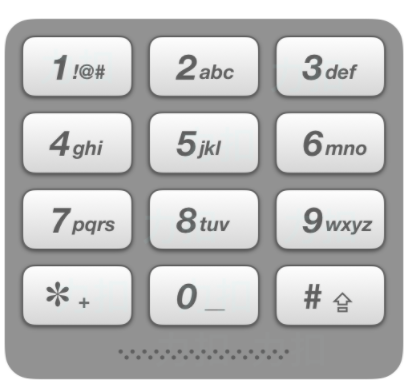

# 动态规划

## 1. **综述**


> 1. 动态规划一般用于解决 `一个问题可以分解为多个子问题` 的情况， 并且通常用于求最值
> 2. 因为有 `DP Table` , 所以动态规划是 `自底向上` 解决问题的, 并且一般使用 `迭代(而不是递归)` 解决问题

## 2. **DP Table 和重叠子问题**


> 1. 动态规划一般存在`重叠子问题`, 会导致 `重复计算`. 
>
> 2. 将子问题的`计算结果储存起来( DP Table )`, 避免**重复计算**, 本质是`对递归树剪枝`
>
> 3. `DP Table` 可以存储**全部子问题**的结果, 也可以**只存储一部分**的, 后者称为 `状态压缩`
>
> 4. `DP Table` 可以是多维的, 取决于对问题的抽象程度
>
>    ```java
>    // DP Table 的索引是状态变量的值
>    // 存储的值是 f(n)
>    n = {i,j,k};
>    dp[i][j][k] = f(n);
>    ```
>   ```
> 
>   ```

## 3.**状态转移方程**

> 1. 状态转移方程用于描述问题, 拥有`初始值(base case)`和`状态变量( n )`
>
>    

## 4. **最优子结构**

## 5. **一般流程**

> 1. 明确 状态变量, **即确定 n**
>
>    > 1. 非常重要, 不同的问题有不一样的抽象方式
>
> 2. 明确 状态方程, **即 f(n) = 什么**
>
> 3. 确定 base case, **即 f( n ) = 常数的时候**
>
> 4. 写出 状态转移方程, **即写出 f(n) **
>
> 5. 明确 选择, **即什么会导致 n 变化**
>
> 6. 求解 `DP Table`


# 数组


## 左右指针

### 二分查找

```java
    /**
     *
     * @param nums 升序数组
     * @param target 目标值
     * @param bounderType 
     * 边界类型， 大于零表示左边界， 等于零表示没有边界， 小于零表示左边界
     * 左边界 = "如果目标值有重复, 返回最左边的序号", 右边界同理
     * @return 返回目标值在数组中的序号
     */
public static int divSearch(int[] nums, int target, int bounderType){

    int left=0, right = nums.length-1;

    // 设为 -1 ,运用了 "哨兵机制"
    int targetPosition=-1;

    // 当 left 指针越过 right 时, 退出搜索
    // 因为没有元素会 大于 right 而小于 left
    while (left<=right){

        // 计算中间位置
        int midPosition = (left + right)/2;

        // 取中间位置的元素
        int mid = nums[midPosition];

        // 如果 目标值 "小于中间位置的值"
        // 说明 "目标值" 只会在比 "中间位置小的地方"
        // 即 右指针应该移动到中间位置的左边, 左指针不动
        // 从 比中间位置 小的地方开始搜索
        if (target < mid)
            right = midPosition-1;

        // 如果 在中间位置命中, 根据不同的边界, 有不同的表现
        else if (target==mid){

            // 如果没有边界, 则直接返回中间位置
            if (bounderType==0){
                return midPosition;
            }

            // 如果是 "右边界"
            // 则应该返回数组中, "重复的目标值" 中 "最右边的索引"
            // 所以应该右指针不动, 左指针移动到 中间位置的右边
            // 从 "已经命中的中间位置" 右边开始搜索
            else if (bounderType>0){
                left = midPosition + 1;
                targetPosition = midPosition;
            }

            // 如果是 "左边界"
            // 则应该返回数组中, "重复的目标值" 中 "最左边的索引"
            // 所以应该左指针不动, 右指针移动到 中间位置的左边
            // 从 "已经命中的中间位置" 左边开始搜索
            else {
                right = midPosition - 1;
                targetPosition = midPosition;
            }


        }

        // 如果 目标值 "大于中间位置的值"
        // 说明 目标值 应该在 "中间位置的右边"
        // 则 左指针移动到 "中间位置的右边"
        // 从 中间位置的 "右边" 开始搜索
        else if (target>mid)
            left = midPosition+1;

    }

    return targetPosition;

}
```


### 有序数组平方

```java
    /**
     * 左右指针算法
     * @param nums 升序数组
     * @return 每个元素平方后排好序的数组
     */
public static int[] sortedSquares(int[] nums) {
    // 左右指针初始化
    int right = nums.length - 1;
    int left = 0;

    // 新的数组初始化
    // index 用来控制在新的数组写入的位置
    int[] result = new int[nums.length];
    int index = result.length - 1;


    // 这里的思路是
    // 升序数组中, 可能存在正数和负数, 那么负数平方后有可能会大于正数
    // 那么这就说明, 数组平方后的最大值只可能存在 最左或者最右两个端点
    // 所以使用左右指针, 指向数组的两端, 并且根据两者指向的元素平方后的大小比较
    // 移动两个指针中的一个
    // 这里要注意的 edge case 是, 
    // 当两个指针相邻时, 比较完之后还要把剩下的那个元素放入新数组
    // 所以 while 的终止条件是 小于等于, 即使用了 哨兵技巧
    while (left <= right) {
        if (nums[left] * nums[left] > nums[right] * nums[right]) {
            result[index--] = nums[left] * nums[left];
            ++left;
        } else {
            result[index--] = nums[right] * nums[right];
            --right;
        }
    }
    return result;
}
```


### 两数之和

```java
    /**
     * 左右指针计算两数之和, 返回的是坐标
     * @param nums 数组,必须是排好序的
     * @param target 目标值
     * @return 两数的坐标
     * 思路 : 左右指针指向数组两端, 根据 sum 与 target 的大小关系, 移动左或右指针
     */
public static int[] twoSum(int[] nums, int target){

    int left = 0;
    int right = nums.length-1;
    int[] result = new int[2];

    while (left<right){

        int sum = nums[left] + nums[right];

        if (sum==target){
            result[0] = left;
            result[1] = right;
            return result;
        }
        else if (sum>target){
            right--;
        }
        else {
            left++;
        }


    }

    return null;
}
```


### n 数之和

```java
// 以三数之和为例, 将问题转化为 在数组中找 a,b,c 三个值, 使得 a + b + c = target
// 先指定数组的第一个数字为 a, 求解 b,c 的值就可以使用 "两数之和" 的方法了
// 注意此时的 target = target - a

// 如果要求去重, 则判断 a 是否与上一次指定的 a 数值相同, 相同则跳过本次循环

// 双指针法只能用于 "排好序的数组"
```


## 原地删除元素 - 快慢指针

```java
    /**
     * 快慢指针算法
     * @param nums 数组
     * @param val 要删除的元素
     * @return 删除给定元素后数组的大小
     * 例子 : 数组 = {1,2,3,3,4} , 要删除的元素 = 3, 
     * 删除给定元素后的数组 = {1,2,4,3,3}, 数组大小 = 3
     */
public static int deleteValInNums(int[] nums, int val){

    // 一开始快慢指针同速前进
    int fastPointer = 0;
    int slowPointer = 0;

    for (; fastPointer < nums.length; fastPointer++) {

        // 1. 这里的思路就是, 当快指针指向的元素与目标值相同时, 
        // 2. 慢指针不动, 快指针继续前进, 
        // 3. 此时不做覆盖动作, 相当于只是标记元素
        // 4. 当快指针指向的元素与目标值不同时,
        // 5. 表示此时需要执行覆盖动作, 所以将快指针指向元素覆盖慢指针指向元素
        // 6. 并且两个指针同时前进
        if (nums[fastPointer]!=val){

            nums[slowPointer] = nums[fastPointer];
            slowPointer++;

        }
    }
    return slowPointer;


}
```


## 螺旋矩阵 - 代码控制

### 代码

```java
    /**
     * 螺旋矩阵, 即顺时针填充数组
     * @param n 数组大小, 规定是 nxn 形状
     * @return 返回填充之后的数组
     */
public static int[][] matrix(int n){
    int[][] res = new int[n][n];

    // 循环次数
    // 如果 n 为偶数, 则在下面的 while 循环中填充完成
    // 如果 n 是奇数, 则需要在 while 下面的判断中, 将数组 '中间' 的位置,
    // 也就是下面计算的 mid 位置填充好
    int loop = n / 2;

    // 计算中间位置
    int mid = n / 2;

    // 定义第一次 while 循环起始位置
    // 即从 左上角开始
    int startX = 0;
    int startY = 0;

    // 定义已经填充的层数
    // 因为思路采取的是左闭右开的填充方式
    // 即每一层 不填充最后一位
    // 所以 filledLayersNum 设为 1
    int filledLayersNum = 1;

    // 定义填充数字
    int count = 1;


    // 思路是, 每一次 while 循环, 包含四个 for 循环
    // 每个 for 循环打印一层(左闭右开)
    // 即一次 while 循环打印一圈
    while (loop>0){

        // 注意, 二维数组的[i][j]
        // 第一个表示纵坐标, 第二个表示横坐标
        int i = startY;
        int j = startX;

        // 左到右打印
        for (;  j<n - filledLayersNum ; j++) {
            res[i][j] = count;
            count++;
        }

        // 上到下打印
        for (; i<n-filledLayersNum; i++){
            res[i][j] = count;
            count++;
        }

        // 右到左打印
        for (; j>filledLayersNum-1;j--){
            res[i][j] = count;
            count++;
        }

        // 下到上打印
        for (;i>filledLayersNum-1;i--){
            res[i][j] = count;
            count++;
        }


        // startX, startY 往右下方前进一格
        startX++;
        startY++;

        // filledLayersNum++, loop--,  表示已经打印了一层
        filledLayersNum++;
        loop--;

    }

    // 如果 n 为奇数, 则需要填充 数组中间的位置
    if (n%2==1){
        res[mid][mid] = count;
    }

    return res;
}
```


### 过程示意图( 左闭右开 )


## 连续子数组之和 - 滑动窗口

```java
    /**
     * 滑动窗口算法
     * @param nums 给定数组
     * @param val 数组中 某一连续的子数组的和要大于等于 val, 求该子数组的最小长度
     * @return 返回符合条件的子数组的长度
     * 具体思路参考字符串中的滑动窗口
     */
public static int slightWindow(int[] nums, int val){

    int sum, left, right, length;
    sum = left = right =  0;
    length = Integer.MAX_VALUE;

    while (right<nums.length){

        sum += nums[right];
        right++;


        while (sum>=val){

            int leftVal = nums[left];
            sum -= leftVal;

            if (right-left<length){

                length = right - left;
            }
            left++;

        }


    }

    return (length==Integer.MAX_VALUE)?0:length;
}
```


---


# 链表

## 链表的刷题技巧

*虚拟头结点：* 为链表新建 **一个空的结点**， 即使用了**哨兵技巧**， 不需要再为真实的头结点	   						 **额外编写处理代码**

*引用和结点：* 对于链表来说， `Node current = new Node()` 中的 `new Node()` 相当于								在内存中创建一个 **真实的结点**，而 `Node current` 则表示 **一个引用**，指向								这个新建的结点， 对 `current` 重新赋值, **并不会**改变该结点, 只是改变这个								**引用的指向**

*引用相互赋值:*	对于 **引用** 来说, `current = next` ( current 和 next 都是指向两个不									同的结点的引用) **不是** 将 current 指向 next, 而是先生成一份 **引用 									next 的副本**, 然后**赋值给 current**, 之后 改变 current **不会 改变 									next**


## 反转链表 - 双指针

### 代码

```java
    /**
     * 双指针反转链表
     * @param current 链表的头结点, 运用哨兵技巧即当前结点
     * @return 反转后的链表的头结点
     * [prev引用] 指向当前结点的 [前一个结点], 
     * [current引用] 指向当前结点, [next引用] 指向当前结点的 [下一个结点]
     * 步骤 : [current结点] 指向 [prev结点], 
     * 然后 [prev引用] 移动到 current, [current引用] 移动到 next
     */
public static Node reverseNodeList(Node current){

    // 虚拟表头，是一个值为 null 的结点
    // 即使用哨兵技巧, 不需要为 头结点 额外写处理代码
    Node prev = null;

    // 注意跳出条件为 当前结点不为空
    // 因为我们需要遍历到链表的最后一个结点
    while (current!=null){

        // 缓存当前结点的下一个结点
        Node next = current.next;

        // 修改当前结点指向, 指向它的前一个结点
        // 对于头结点来说, 就是指向空结点
        current.next = prev;

        // prev引用 移动一格
        prev = current;

        // current引用 移动一格
        current = next;
    }
    return prev;
}
```


### 步骤

-16279807206382.png)


## 两两交换结点 - 代码控制

### 代码

```java
    /**
     * 两两交换结点-代码控制
     * @param head 链表的头结点
     * @return 两两交换结点之后链表的头结点
     * 变量 : current 指向当前结点, 
     * next1 为第二个结点, next2 为第三个结点, next3 为第四个结点
     * 步骤 : 第三个结点指向第二个, 第二个指向第四个, 当前指向第三个,
     * 然后移动 current 指针指向 "第二个结点"
     * (注意此时链表已经发生改变, current 指针的位置其实是在 "第三个结点")
     */
public static Node changeNodeInStep2(Node head){


    // 新建两个虚拟头结点 - 哨兵技巧
    Node virtualHead = new Node();
    Node current = new Node();
    current.next = head;
    virtualHead.next = current;

    // 第一个判断是结点数量为偶数的情况
    // 第二个判断是结点数量为奇数的情况
    while (current.next!=null && current.next.next!=null){


        Node next3 = current.next.next.next;
        Node next2 = current.next.next;
        Node next1 = current.next;

        current.next.next.next = current.next;
        current.next.next = next3;
        current.next = next2;
        current = next1;

    }
    return virtualHead.next.next;

}
```


### 步骤

-16279814936605.png)


.png)


## 删除链表中倒数第N个结点/找到链表的中点 - 快慢指针、递归

### 快慢指针

```java
    /**
     * 快慢指针删除倒数第 n 个结点
     * @param head 链表头
     * @param n 倒数第 n 个结点
     * 快指针和慢指针保持 n + 1 格距离, 当快指针走到尾部时, 慢指针就相当于指向倒数第 n + 1 个结点
     */
public static void deleteLastNthNodeDoublePointer(Node head, int n){

    // 虚拟头结点, 当要删除的结点是链表头部时, 方便操作
    Node dummyHead = new Node();
    dummyHead.next = head;

    // 快慢指针初始化
    Node fast = dummyHead;
    Node slow = dummyHead;

    // 快指针前进 n 步
    while (n>0){
        fast = fast.next;
        n--;
    }

    // fast 再前进一步, 现在快慢指针就相差 n + 1 步了
    fast = fast.next;

    // 快慢指针同时前进, 直到快指针到链表结尾
    // 这里的判断条件为 fast!=null, 即快指针走到尾部结点后, 
    // 还会再走一步才停止, 即快指针总共走了 链表长度 + 2 的距离
    // 引入 dummyHead 的长度就抵消了
    while (fast!=null){
        slow = slow.next;
        fast = fast.next;
    }

    // 执行删除任务
    slow.next = slow.next.next;

}
```


### 递归

```java
// 因为递归到尾部的时候, 不会执行 ++lastNthStep, 所以需要初始化为 1
public static int lastNthStep = 1;
public static Node target;

    /**
     * 递归找到要删除结点的前一个结点
     * @param current 链表的头结点
     * @param n 倒数第 n 个
     * lastNthStep 开始 “归” 的时候记录走过的步数
     * target 倒数第 n 个结点的前一个结点， 如果 target 为 null， 说明要删除的结点是链表头部
     */
public static void findLastNthNode(Node current, int n){

    // 遍历到链表尾部, 则退出
    if (current.next==null){
        return;
    }

    // 进入递归
    findLastNthNode(current.next, n);

    // 步数递增
    ++lastNthStep;

    // 因为要返回第 n 个结点的前一个结点, 所以设置为 n + 1
    if (lastNthStep == (n+1))
        target = current;
}
```


## 找到链表交汇的地方 - 代码控制

```java
    /**
     * 找到链表交汇的地方, 注意交汇的地方是指 指针相同, 而不是 值相同
     * @param headA 链表 A 的头部
     * @param headB 链表 B 的头部
     * @return 返回交汇的结点
     * 思路 : 计算两个链表的长度, 将两个链表对齐后开始比较
     */
public static Node findIntersectionNode(Node headA, Node headB){

    // 分别计算两个链表的长度
    int headALength = 0;
    int headBLength = 0;
    Node pointer = headA;
    while (pointer!=null){
        headALength++;
        pointer = pointer.next;
    }
    pointer = headB;
    while (pointer!=null){
        headBLength++;
        pointer = pointer.next;
    }

    // 计算链表需要对齐的长度
    int flag = -1;
    int diff;
    if (headALength>headBLength){
        flag = 1;
        diff = headALength - headBLength;
    }
    else {
        diff = headBLength - headALength;
    }

    // 链表对齐
    while (diff>0){
        if (flag>0){
            headA = headA.next;
        }
        else headB = headB.next;
        diff--;
    }

    // 从对齐的地方开始比较
    while (headA!=null){
        if (headA == headB){
            return headA;
        }
        headA = headA.next;
        headB = headB.next;
    }

    return null;
}
```


## 找到链表环的起点/判断链表是否有环 - 快慢指针

### 判断是否有环的思路

*套圈 :* 慢指针每次前进一格, 快指针每次前进两格, `如果有环`, 那么 **快指针和慢指针一定可以			   相遇**


### 找到环的起点

```java
    /**
     * 快慢指针找链表环的入口
     * @param head 链表的头部
     * @return 链表中环的入口
     * 思路 : 快指针前进两格, 慢指针前进一格, 相遇证明有环, 
     * 此时将满指针指向链表头部, 两个指针同速前进
     * 再次相遇就是链表环的入口
     * 具体看公式推导
     */
public static Node findCycleEntry(Node head){

    // 快慢指针初始化
    Node slow = head;
    Node fast = head;

    while (fast!=null){

        // 快慢指针差速前进
        fast = fast.next.next;
        slow = slow.next;

        // 相遇之后慢指针指向头部, 两个指针同速前进......
        if (fast == slow){
            slow = head;
            while (slow!=null){
                fast = fast.next;
                slow = slow.next;
                if (slow == fast){
                    return slow;
                }
            }
        }

    }
    return null;

}
```


# 哈希表

## 数组实现字母哈希表

### 判断是否为异位词

```java
    /**
     * 数组实现字母表的哈希表
     * @param a 字符串 1
     * @param b 字符串 2
     * @return 如果是异位词, 则返回 true ,否则返回 false
     * 异位词 : 两个字符串字母一样, 位置不一样
     * 思路 : 字母 ascll码 减去字母 'a' 的 ascll码, 即将原来的 ascll码映射为 0~25 的数字
     * 从而实现小写字母的哈希表
     */
public static boolean isAnagram(String a, String b){

    int[] record = new int[26];

    for (char c : a.toCharArray()) {
        record[c - 'a'] = ++record[c - 'a'];
    }

    for (char c : b.toCharArray()) {
        record[c - 'a'] = --record[c - 'a'];
    }

    for (int i : record) {
        if (i!=0) return false;
    }

    return true;


}
```


### 找出在所有字符串都出现的字母

```java
    /**
     * 数组字母哈希表处理相同字符
     * @param A 字符串集合
     * @return 在所有字符串中都出现的字母, 如果有相同的也要统计
     * 例如 : "ll", "ll", "ll", 则应该返回 'l','l'
     */
public static List<String> commonChars(String[] A) {
    List<String> result = new ArrayList<>();
    if (A.length == 0) return result;
    int[] hash= new int[26];

    // 用第一个字符串给hash初始化
    for (int i = 0; i < A[0].length(); i++) {
        hash[A[0].charAt(i)- 'a']++;
    }

    // 统计除第一个字符串外字符的出现频率
    for (int i = 1; i < A.length; i++) {
        int[] hashOtherStr= new int[26];
        for (int j = 0; j < A[i].length(); j++) {
            hashOtherStr[A[i].charAt(j)- 'a']++;
        }

        // 更新hash，保证hash里统计26个字符在所有字符串里出现的最小次数
        for (int k = 0; k < 26; k++) {
            hash[k] = Math.min(hash[k], hashOtherStr[k]);
        }

    }

    // 将hash统计的字符次数，转成输出形式
    for (int i = 0; i < 26; i++) {

        // 注意这里是while，多个重复的字符
        while (hash[i] != 0) {
            char c= (char) (i+'a');
            result.add(String.valueOf(c));
            hash[i]--;
        }
    }
    return result;
}
```


### 赎金信

## Map 求交集

### 数组交集

```java
    /**
     * HashSet 用于去重和求交集( contains 方法 )
     * @param nums1 数组 1
     * @param nums2 数组 2
     * @return 两个数组的交集
     * 思路 : 将一个数组存储在 hashset 里面, 另一个数组就用 contains 方法求交集
     */
public static Set<Integer> intersection(int[] nums1, int[] nums2){

    HashSet<Integer> integers = new HashSet<>();
    HashSet<Integer> result = new HashSet<>();

    for (int i : nums1) {
        integers.add(i);
    }

    for (int i : nums2) {
        if (integers.contains(i)){
            result.add(i);
        }
    }

    return result;

}
```


### 判断是否为快乐数

```java
    /**
     * 哈希表求交集
     * @param n 整型
     * @return 如果 n 为快乐数, 则返回 true, 否则返回 false
     * 快乐数 : 对于一个正整数，每一次将该数替换为它每个位置上的数字的平方和，重复这个过程
     * 如果最终该数变成 1, 则该数为 "快乐数"; 否则这个过程会 "无限循环"
     * 思路 : 无限循环 = 平方和会重复出现, 即判断平方和是否重复出现即可
     */
public static boolean isHappy(int n) {
    Set<Integer> record = new HashSet<>();
    while (n != 1 && !record.contains(n)) {
        record.add(n);
        n = getNextNumber(n);
    }
    return n == 1;
}


/**
     * 输入一个整数, 返回它每个位置上的数字的平方和
     * @param n 整数
     * @return 平方和
     */
private static int getNextNumber(int n) {
    int res = 0;

    // %10运算 表示 "取" 个位上的数字
    // /10运算 表示 "去除" 个位上的数字
    while (n > 0) {
        int temp = n % 10;
        res += temp * temp;
        n = n / 10;
    }
    return res;
}
```


## Map 利用差数求交集

### 两数之和

```java
    /**
     * 两数之和 : 利用 差数 和 Map 求交集
     * @param nums 数组
     * @param target 目标值
     * @return 两个数字在数组中的下标
     * 思路 : 如果数组是有序的, 那么也可以使用 左右指针,
     * 如果数组是无序的, 那么可以使用 Map 集合, key为数值大小, value为数值下标
     * 使用 target - nums[i] 去求交集
     */
public static int[] twoSum(int[] nums, int target){

    HashMap<Integer, Integer> num = new HashMap<>();
    int[] result = new int[2];

    for (int i = 0; i < nums.length; i++) {
        num.put(nums[i], i);
        int temp = target - nums[i];
        if (num.containsKey(temp)){

            if (num.get(temp)==i) continue;
            result[0] = i;
            result[1] = num.get(temp);
            return result;
        }
    }

    return null;

}
```


### 四数相加

```java
    /**
     * Map求两数之和加强版
     * @param numsA 数组a
     * @param numsB 数组b
     * @param numsC 数组c
     * @param numsD 数组d
     * @return 四元组的数量
     * 题目 : 给定四个包含整数的数组列表 A , B , C , D ,
     * 计算有多少个元组 (i, j, k, l) ，使得 A[i] + B[j] + C[k] + D[l] = 0
     
     * 思路 : 因为只需要求出个数, 而不需要四元组具体的值, 所以可以参考两数之和的方法
     * 将四个数组分为两组, 用两个 Map 分别储存一组, 
     * key为两个数组全排列的和, value为和的次数
     * 然后遍历一个 Map, 用 -key 对另外一个 Map 求交集( contains方法 ), 
     * 如果存在交集, 则四元组个数为 value 相乘
     */
public static AtomicInteger fourSumCount(int[] numsA, int[] numsB, 
                                         int[] numsC, int[] numsD){

    HashMap<Integer, Integer> abHashMap = new HashMap<>();
    HashMap<Integer, Integer> cdHashMap = new HashMap<>();
    AtomicInteger result = new AtomicInteger();

    // 求两个数组全排列的和
    for (int i = 0; i < numsA.length; i++) {
        for (int i1 = 0; i1 < numsB.length; i1++) {
            abHashMap.put(numsA[i]+numsB[i1], abHashMap.getOrDefault(i + i1, 0)+1);
        }
    }
    for (int i = 0; i < numsC.length; i++) {
        for (int i1 = 0; i1 < numsD.length; i1++) {
            cdHashMap.put(numsC[i]+numsD[i1], cdHashMap.getOrDefault(i + i1, 0)+1);
        }
    }

    // 遍历一个数组, 用 -key 求交集
    abHashMap.forEach((k, v)->{
        if (cdHashMap.containsKey(-k)){
            result.addAndGet(v * cdHashMap.get(-k));
        }
    });

    return result;

}
```


# 字符串

## 反转字符串 - 左右指针

```java
    /**
     * 原地反转字符串
     */
    
// 使用双指针指向字符串两端, 然后指针指向的元素交换位置
```


## 代码控制

### 间隔反转字符串

```java
    /**
     * 给定一个字符串 s 和一个整数 k，
     * 你需要对从字符串开头算起的每隔 2k 个字符的前 k 个字符进行反转。
	 * 如果剩余字符少于 k 个，则将剩余字符全部反转。
	 * 如果剩余字符小于 2k 但大于或等于 k 个，则反转前 k 个字符，其余字符保持原样。
     */
    
	for(int i=0;i<string.length;i+=( k*2 )){
        
        // 剩下字符大于 k 个, 小于 2k 个
		if(i + k <=string.length){
            // 反转剩下字符的前 k 个
        }
        else // 反转剩下的全部字符
}
```


### 替换空格

```java
// 题目 : 将空格替换为 %20

// 方法一 : 重新申请一个空间, 然后遍历, 遇到空格则替换

// 方法二(不需要额外的空间) : 
// 		   先遍历一遍, 然后在原有的空间上 "追加申请" 空间, 追加的部分 = 空格数量*3
//		   然后从尾部用双指针遍历替换, 两个指针的间隔为3
```


### 以单词为最小单位反转字符串

```java
// 题目 : 输入 -> that is a cat, 输出 -> cat a is that

// 方法一 : 使用 split 函数将字符串分解为单词, 然后反转字符串

// 方法二 : 去除多余的空格(开头, 结尾, 两个及以上连在一起的空格)
//         然后以字母为最小单位反转整个字符串, 最后再反转每个单词
```


### 左旋转字符串

```java
// 题目 : 输入 -> abcdefg, k=2  输出 -> cdefgab

// 方法一 : 申请新的空间, 然后按条件搬移字符串

// 方法二(不需要额外空间) : 反转前 k 个字符, 然后反转 k~结尾 的字符, 
//						  最后反转整个字符
```


## 滑动窗口

### 最小覆盖子串

```java
    /**
     * 滑动窗口解决子串问题(不保证顺序)
     * @param a 字符串
     * @param target 目标串
     * @return 字符串中 "最短的" 并且可以覆盖目标串的子串
     */
public static String slightWindow(String a, String target){


    // count 的 key 为目标串中字符, value 存放窗口中属于目标串的字符的数量
    HashMap<Character, Integer> count = new HashMap<>();

    // targetMap 的 key 为目标串中的字符, value 为目标串中的字符对应的数量
    HashMap<Character, Integer> targetMap = new HashMap<>();


    // 填充两个 Map
    for (char c : target.toCharArray()) {
        count.put(c, 0);
        targetMap.put(c, targetMap.getOrDefault(c, 0)+1);
    }


    // length 初始化为最大值, 即使用哨兵机制, 方便后续判断
    int left, right, length, start, valid;
    left = right = valid = start = 0;
    length = Integer.MAX_VALUE;

    // 开始处理
    while (right<a.length()){

        // right 先自增再缩小窗口, 保证 length > 0
        char charAtRight = a.charAt(right);
        right++;

        // 当 count 里面的 value 与 targetMap 里面的 value 相等, 
        // 则说明当前窗口里已经覆盖了 "目标串中一个字符"
        // 所以 valid 自增
        // 此处说明 count.value 可能大于 targetMap.value
        if (count.containsKey(charAtRight)){
            count.put(charAtRight, count.get(charAtRight)+1);
            if (count.get(charAtRight).equals(targetMap.get(charAtRight))){
                valid++;
            }
        }

        // valid 与 count/targetMap 的大小相等时, 
        // 说明当前窗口里已经覆盖了 "整个目标串"
        // 则需要缩小窗口
        while (valid==count.size()){

            char charAtLeft = a.charAt(left);

            // 如果缩小窗口时包含目标串中的字符
            // 则 count.value 自减
            // 当 count.value 小于 targetMap.value 时, 
            // 说明窗口 "已经不覆盖" 目标串了
            // 则需要停止缩小窗口, 转而扩大窗口, 并且记录此时窗口的大小和起始位置
            if (count.containsKey(charAtLeft)){
                count.put(charAtLeft, count.get(charAtLeft)-1);

                if (count.get(charAtLeft)<targetMap.get(charAtLeft)){
                    valid--;

                    if (right - left < length){
                        length = right - left;
                        start = left;
                    }
                }
            }
            left++;

        }

    }

    return a.substring(start, start+length);
}
```


# 栈和队列

### Java 使用栈

*Java 的栈有设计上的缺陷, 官方推荐使用 Deque( Double End Queue ) 实现栈,* 

*底层的数据结构可以选择 ArrayDeque 或者 LinkedDeque*


### 栈实现队列

```java
一个为 输入栈, 一个为 输出栈 实现队列
    
    放入元素(push) : 放入输入栈
    
    取出元素(pop) :  如果两个栈都为空 --> 队列为空, 返回空元素
                    如果输出栈有元素 --> 从输出栈取出元素
    				如果输入栈有元素, 输出栈没有元素 --> 将输入栈的元素放入输出栈, 然后从输出栈取出元素
```


### 队列实现栈

```java
一个为 存储队列, 一个为 临时队列
    
    放入元素(push) : 放入存储队列中
    
    取出元素(pop) : 将存储队列中的所有元素(除了最后一个元素) 放入临时队列, 然后取出最后一个元素, 
				   最后将临时队列中的元素依次放回存储队列
```


### 括号匹配( 对称匹配 )

```java
利用栈判断表达式是否合法 --> 例子 : [}, [(]) 等就是不合法的

	({[ 等左括号入栈时, 换成对应的右括号, 当遇到右括号时, 出栈顶元素并判断是否匹配, 不匹配则表达式不合法
       并且, 如果最后整个表达式走完, 如果栈仍有元素, 则匹配失败
```


## 删除相邻并且相同的元素

```java
使用栈存储这些元素, 在入栈的时候使用 peek 函数, 如果两个元素相同, 则将栈中的元素出栈, 并且当前元素放弃入栈
    过程类似 消消乐
```


### 逆波兰表达式求值

```java
常用的表达式为 中缀表达式 : (1+3)*(4+5)
转换为 逆波兰表达式为 : 13+45+*
    即 当遇到运算符的时候, 将前两个数字根据运算符运算, 将结果放回原来的位置
    
使用栈处理逆波兰表达式 : 将数字压入栈, 遇到运算符的时候, 弹出两个元素进行计算, 然后将结果放入栈中
```


## 滑动窗口的最大值 - 单调队列

```java
/**
 * 单调递减的队列, 队列中的元素 "永远" 按照递减的顺序排好序
 * 要维护这个队列, 重点在于 add(添加元素到队列尾部) 的方法
 * 当使用 add 方法时, 需要判断此时队列尾部的元素 "是否大于当前入队的元素"
 * 不是的话则将队列尾部的元素移出队列
 * 重复执行上述行为, 直到满足规则
 */
public class DescQueue {

    private Deque<Integer> deque = new ArrayDeque<>();

    void add(int value){

        while (deque.peekLast()!=null && deque.peekLast()<value){
            deque.removeLast();
        }
        deque.addLast(value);
    }

    void removeFirst(){
        deque.removeFirst();
    }

    int peekMax(){
        return deque.peekFirst();
    }

}


    /**
     * 单调递减的队列
     * @param nums 数组
     * @param k 窗口大小, 移动的步长为 1
     * @return 每次移动, 窗口中的最大值
     * 题目 : 有一个窗口, 大小为 k, 步长为 1, 在数组中往尾部移动,
     * 你需要返回每次移动, 窗口中最大的元素
     * 思路 : 将窗口中的元素添加到 "单调递减队列中", 队列会自动找到最大的元素,
     * 窗口移动的时候, 判断移出窗口的元素是否在队列的头部,
     * 是则将元素从队列中移出, 否则不执行任何操作
     */
public static List<Integer> slidingWindow(int[] nums, int k){

    // 储存结果
    ArrayList<Integer> integers = new ArrayList<>();
    DescQueue descQueue = new DescQueue();

    // 使用一个全局的索引维护窗口
    // i 在窗口初始化后, 永远指向窗口的尾部
    int i = 0;

    // 窗口初始化
    // 即进行第一次移动
    for (; i < k; i++) {
        descQueue.add(nums[i]);
    }

    // 保存结果
    integers.add(descQueue.peekMax());

    // 开始移动窗口
    for (; i<nums.length ; i++) {

        // 判断移出窗口的元素是否等于队列的头部元素
        // 是则从队列中移出元素
        if (nums[i-k]==descQueue.peekMax()){
            descQueue.removeFirst();
        }

        // 将加入窗口的元素放入队列
        // 队列会自动找出窗口中的最大值, 即队列头部的元素
        descQueue.add(nums[i]);

        // 保存结果
        integers.add(descQueue.peekMax());
    }

    return integers;
}
```


# 二叉树

## 递归遍历

```java
    /**
     * 二叉树的递归遍历
     * @param current 当前结点
     * @param manner 遍历的方式
     * 使用递归进行二叉树的遍历, 代码的顺序和遍历的顺序一致
     */
public static void printlnTree(TreeNode current, String manner){

    // 中序和后序遍历都是到树的最底层, 才开始处理
    
    if (current==null) return;

    // 中 --> 左 --> 右 = 前序遍历
    if (manner.equals("front")){
        System.out.println(current); //中
        printlnTree(current.left, manner); //左
        printlnTree(current.right, manner); // 右
    }

    // 左 --> 中 --> 右 = 中序遍历
    if (manner.equals("middle")){
        printlnTree(current.left, manner); // 左
        System.out.println(current); // 中
        printlnTree(current.right, manner); // 右
    }

    // 左 --> 右 --> 中 = 后序遍历
    if (manner.equals("back")){
        printlnTree(current.left, manner); //左
        printlnTree(current.right, manner); //右
        System.out.println(current); //中
    }
}
```


# 回溯


## 综述

*回溯算法的行为 **就是穷举** , 通常用于在一个集合中寻找所有符合条件的 **子集**, 比如 全排列/全组合 的问题. 因为此类问题通常**无法使用 for/while** 等迭代的方法穷举, 所以可以将回溯算法理解为一种 **动态创建 for 循环的 算法***

*所有回溯算法解决的问题都可以抽象为 **决策树**, 集合的大小就是这颗树的宽度和深度*


## 全组合/全排列

### 一个集合内求 全组合/全排列

```java
    /**
     * 回溯算法解决 全组合/全排列 问题.
     * 组合: 无序集合,即 [1,2,3] 和 [2,3,1] 视为一个集合; 排列 : 有序集合, 即 [1,2,3] 和 [2,3,1] 是两个集合
     * @param startIndex 每次循环的起始位置
     * @param nums 数组
     * @param k 集合的大小
     * @param resultTmp 存储 "路径"
     * @param resultList 存储结果
     * 题目 : 在集合中寻找所有 "大小为 k 的 组合/排列" 的子集
     */
public static void combinationOrArrangement(int startIndex, int[] nums, int k,String manner
                                            LinkedList<Integer> resultTmp, 
                                            ArrayList<List<Integer>> resultList){

    // 子集的大小满足条件, 则退出
    if (resultTmp.size()==k){
        resultList.add(new LinkedList<>(resultTmp));
        return;
    }


    for (int i = startIndex; i < nums.length; i++) {

        // 全组合意味着每次递归创建的 for 循环,
        // 应该从上一个栈帧的位置 "往前" 搜索, 所以传入的 startIndex = i + 1
        if (manner.equals("combination")){
            resultTmp.add(nums[i]);
            combinationOrArrangement(i+1, nums, k, resultTmp, resultList, manner);
            resultTmp.removeLast();
        }

        // 全排列意味着每次递归创建的 for 循环,
        // 应该 "从头开始搜索", 所以传入的 startIndex = 0
        // 并且需要配合去重
        else if (manner.equals("arrangement")){
            if (!resultTmp.contains(nums[i])){
                resultTmp.add(nums[i]);
                combinationOrArrangement(0, nums, k, resultTmp, resultList, manner);
                resultTmp.removeLast();
            }
        }
    }

}
```


### 多个集合内求 全组合/全排列



```java
    /**
     * 多个集合内求 全组合/全排列
     * @param number 电话号码字符串
     * @param startIndex 从 number 中挑选字符的位置
     * @param phoneNumberMap 电话本的映射关系 --> 即两个集合的映射关系
     * @param temp 存储路径
     * @param result 存储结果
     * 题目 : 电话本
     */
public static void phoneNumberCombine(String number, int startIndex, Map<Character, String> phoneNumberMap,
                                      StringBuilder temp, ArrayList<String> result){

    // 路径等于 number 的长度
    // 即从每个数字映射的字母串中都挑选了一个字母
    if (temp.length()==number.length()){
        result.add(temp.toString());
        return;
    }

    // 因为有两个集合, 并且这两个集合存在映射关系
    // 所以需要两层循环
    for (int i = startIndex; i < number.length(); i++) {

        // 第一层循环从一个集合里面挑选
        char c = number.charAt(i);

        // 第二层循环根据映射关系从另外一个集合里面挑选
        for (char c1 : phoneNumberMap.get(c).toCharArray()) {
            temp.append(c1);

            // 因为是 全组合, 所以 startIndex = i + 1
            phoneNumberCombine(number,i+1, phoneNumberMap, temp, result);
            temp.deleteCharAt(temp.length()-1);
        }
    }
}
```

