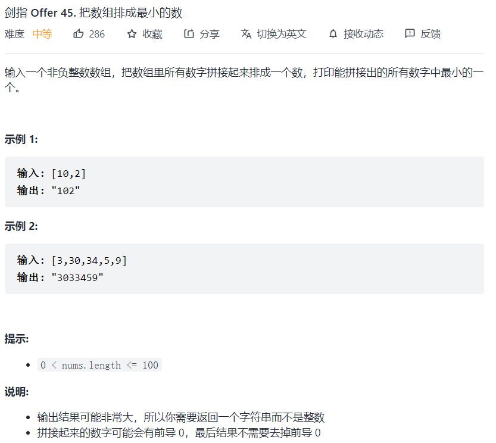

# 剑指 Offer ( 第二版 )


## 剑指 Offer 45. 把数组排成最小的数

### 题目



### 搜索 - 全排列

```java
public static long result = Long.MAX_VALUE;


public static void backTracking(int[] nums, int startIndex,
                                LinkedList<Integer> path){

    if (path.size()== nums.length){

        StringBuilder stringBuilder = new StringBuilder();

        for (Integer integer : path) {
            stringBuilder.append(integer);
        }

        long l = Long.parseLong(stringBuilder.toString());
        if (l<result) result = l;
        return;
    }


    for (int i = startIndex; i < nums.length; i++) {
        if (!path.contains(nums[i])) {
            path.add(nums[i]);
            backTracking(nums, 0, path);
            path.removeLast();
        }

    }

}
```


### 排序


## 剑指 Offer 20. 表示数值的字符串

### 题目


### 有限状态机