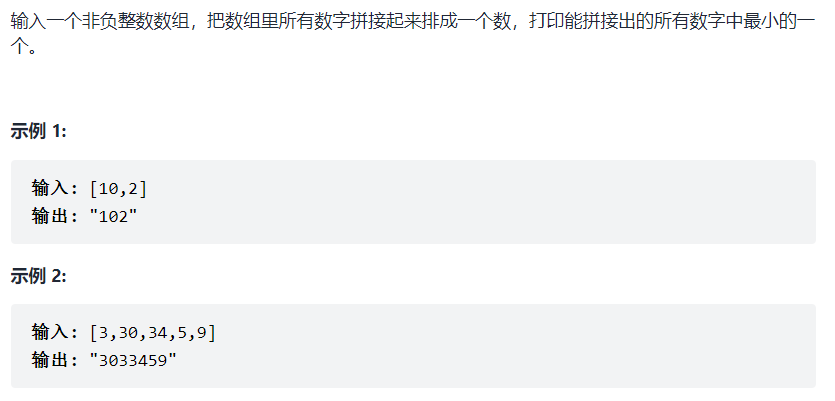

# 把数组排成最小的数



## 搜索解法

```java
// 可以利用 深搜或者广搜, 把全部结果比较一遍
// 但是因为数字会很大, 所以无法 ac
```


## 排序解法

```java
    /**
     *
     * @param nums 数组
     * @return 结果
     * 思路 : 如果 ab > ba, 则定义为 b < a, 按照这种规则将整个数组升序排序, 即可得到结果
     * 严格来讲, 这需要从数学上证明 传递性
     * 简单理解来讲, 对于最终结果, 假设是 abcdef, 那么肯定有 ab < ba, bc < cb, cd < dc ......
     * 即相邻的元素, 肯定满足 ab < ba 这种规则
     */
    public static int minNumber(int[] nums){

        int[] sortedNums = Arrays.stream(nums)
                .boxed()
                .sorted((o1, o2) -> {
                    int front = Integer.parseInt( ""+o1+o2);
                    int behind = Integer.parseInt(""+o2+o1);
                    return front - behind;
                })
                .mapToInt(Integer::intValue)
                .toArray();


        StringBuilder stringBuilder = new StringBuilder();

        for (int sortedNum : sortedNums) {
            stringBuilder.append(sortedNum);
        }

        return Integer.parseInt(stringBuilder.toString());
    }
```


# 生成合法的括号


## 搜索解法

```java
    /**
     *
     * @param leftNum 左括号
     * @param rightNum 右括号
     * @param n 括号数量
     * @param tempResult 临时变量
     * @param results 结果
     * 思路 : 一种显然是暴力遍历全部结果, 然后使用一个栈判断这个括号是否合法
     *          另一种在遍历的时候加入限制
     *            限制一 : 在往临时变量加括号的时候, 第一个位置一定是左括号
     *            限制二 : 开始加右括号的时候, 一定存在左括号, 而且当前右括号的数量小于左括号的数量
     *              流程类似 ((())) -> (()()) -> ()(()) -> ......
     */
    public static void backTracking(int leftNum, int rightNum, int n,
                                    StringBuilder tempResult, List<String> results){

        if (leftNum==n&&rightNum==n){
            results.add(tempResult.toString());
            return;
        }


        if (leftNum<n){
            tempResult.append("(");
            backTracking(leftNum+1, rightNum, n, tempResult, results);
            tempResult.deleteCharAt(tempResult.length()-1);
        }

        if (rightNum<leftNum){
            tempResult.append(")");
            backTracking(leftNum, rightNum+1, n, tempResult, results);
            tempResult.deleteCharAt(tempResult.length()-1);
        }
    }
```

